# Progetto elettronica

## Introduction 
The idea of the project is to show the concept and how to control gripper and rotation via sensor signals. The structure is very simple and made in full of maker and DIY philosophy, only with recycled objects. 
An example in the following figure.

Demonstration: [https://youtu.be/k1hNBbgfAyE](https://youtu.be/k1hNBbgfAyE)

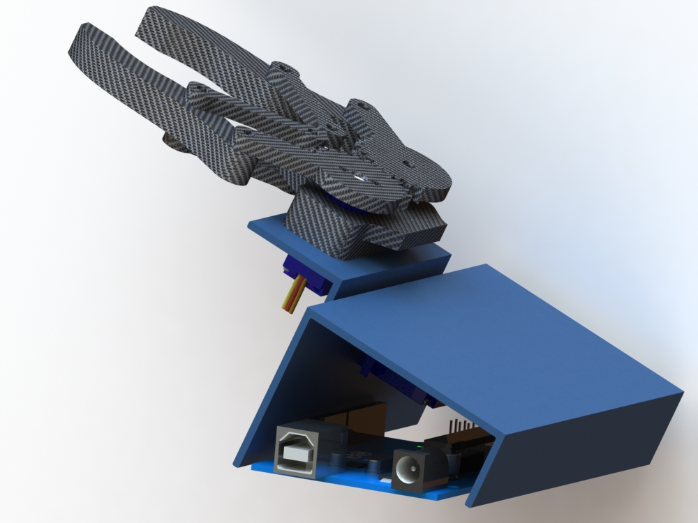 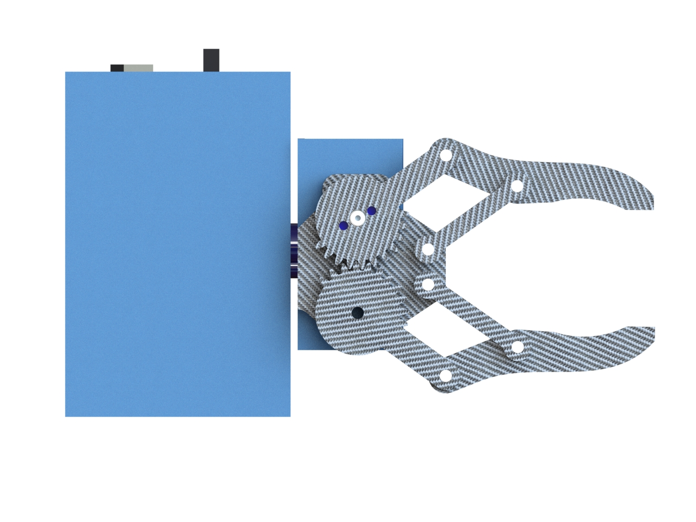 

The gripper has been further simplified in different version but the same project could be realized by purchasing a robot gripper. 

One possibility is to make it with two gears by connecting one to the servomotor. this version involves the use of recycled materials to demonstrate the use of the device.

 

For data charts: [bit.ly/datiprogettoelettronica](http://bit.ly/datiprogettoelettronica). 

## Table of contents
- [Progetto elettronica](#progetto-elettronica)
  * [Introduction](#introduction)
  * [Table of contents](#table-of-contents)
  * [Prerequisites](#prerequisites)
  * [Getting started](#getting-started)
    + [GY-521](#gy-521)
    + [Servo](#servo)
    + [EMG Sensor](#emg-sensor)
    + [EMG Electrodes](#emg-electrodes)
    + [Pulse sensor](#pulse-sensor)
    + [DS18B20 Sensor](#ds18b20-sensor)
    + [Sensor testing](#sensor-testing)
  * [Device division](#device-division)
    + [nRF24L01](#nrf24l01)
    + [Arduino Nano for sensing](#arduino-nano-for-sensing)
    + [Arduino Uno for execution](#arduino-uno-for-execution)
  * [GUI](#gui)
    + [Processing and computer app](#processing-and-computer-app)
    + [Python app](#python-app)
    + [Mobile app](#mobile-app)
    + [iOS App](#ios-app)
  * [Data logging and storage](#data-logging-and-storage)
    + [Esp 8266](#esp-8266)
    + [DHT 11](#dht-11)
    + [MySQL Database](#mysql-database)
    + [POST Request](#post-request)
    + [Data visualizing](#data-visualizing)
  * [Make it more compact](#make-it-more-compact)
    + [Sensors cable](#sensors-cable)
    + [Reading station](#reading-station)
    + [Power supply](#power-supply)
  * [Conclusions and future developments](#conclusions-and-future-developments)
  * [References](#references)
  * [Authors](#authors)


## Prerequisites

* Arduino UNO
* Arduino Nano
* GY-521
* EMG Sensor 
* EMG Electrodes
* Microservo motor SG90
* DS18B20 Sensor
* nRF24L01
* HC-05(06)
* ESP8266 Node Mcu
* TTL Converter 3,3-5V
* RJ45 Connectors & Cat5e cable
* LCD Display (I2C)
* Trimmer
* DHT11
_________________

* [MPU6050_tockn](https://github.com/Tockn/MPU6050_tockn) - Arduino library for easy communicating with the MPU6050
* nRF24L01 Library 
* Vectorial graphic software
* DHT Library

* MySQL server
* Web domain 


## Getting started

> Watch: [https://youtu.be/k1hNBbgfAyE](https://youtu.be/k1hNBbgfAyE)

### GY-521 
GY-521 is a module that manages the MPU-6050 sensor, a chip manufactured by Invensense, which is a IMU (Inertia Measurement Unit) sensor based on MEMS technology that contains a three-axis accelerometer and a three-axis gyroscope embedded in a single chip. This is a 6 DOF (degrees of freedom) IMU sensor so it gives six values as output. It also contains a temperature sensor.

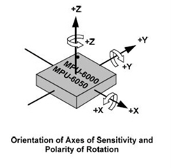

The accelerometer is capable of detecting the angle of inclination along the three axes, while the gyroscope detects the angular velocity around the three axes.
GY-521 module is small in size but it is very accurate, it contains a 16-bit analog to digital conversion hardware for each channel so it captures the x, y, and z channel at the same time.
The sensor uses the I2C protocol for communication.
Two libraries are required one for the I2C and the other for communicating with MPU-6050.
 ```c
 #include <MPU6050_tockn.h>
 MPU6050 mpu6050(Wire);
 #include <Wire.h>
 ```


### Servo 
A servomotor is a rotary actuator or linear actuator that allows for precise control of angular or linear position, velocity and acceleration. It consists of a suitable motor coupled to a sensor for position feedback. It also requires a relatively sophisticated controller, often a dedicated module designed specifically for use with servomotors.

Microservo SG90 is used. It can rotate approximately 180 degrees (90 in each direction) and works just like the standard kinds but smaller.

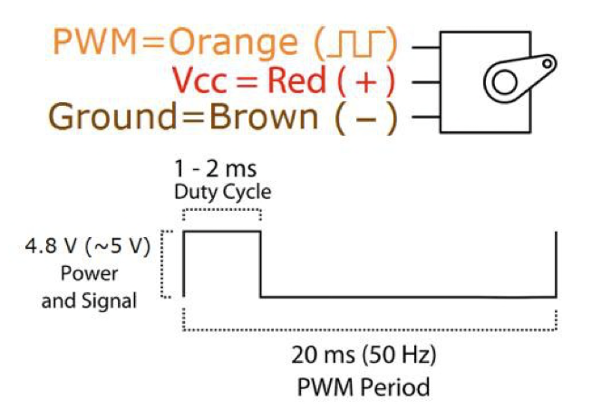

Position "0" (1.5 ms pulse) is middle, "90" (~2ms pulse) is middle, is all the way to the right, "-90" (~1ms pulse) is all the way to the left.
The Servo library is used to control the servo motor.
 ```c
#include <Servo.h> 
Servo servo-object-name;
```

Then use the following command to control angle from 0 to 180 degrees.

 ```c
servo-object-name.write(degrees);
```
The following diagram includes the connection for both the servo and the IMU.

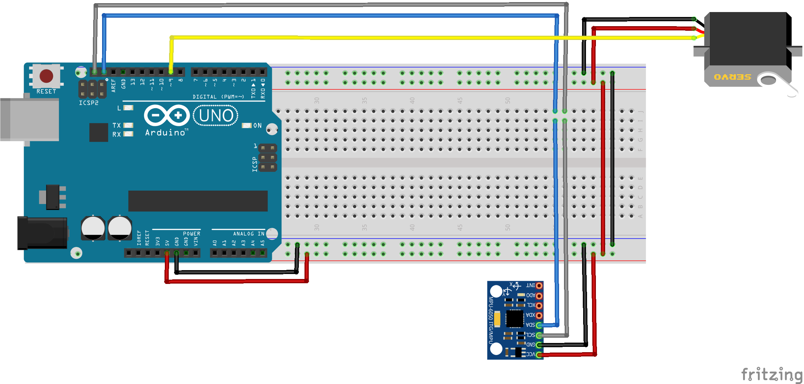

### EMG Sensor
EMG (Electromyography) sensor is able to measure a muscle's activity by monitoring the electric potential generated by muscle cells, electromyography has traditionally been used for medical research and diagnosis of neuromuscular disorders, however now EMG sensors are used in robotics and other control systems. It evaluates the health condition of muscles and the nerve cells that control them. These nerve cells are known as motor neurons. They transmit electrical signals that cause muscles to contract and relax. An EMG translates these signals into graphs or numbers, helping doctors to make a diagnosis.
This sensor amplifies and processes the electric activity of a muscle and converts it into an analog signal which can be read by any microcontroller with an analog-to-digital converter like Arduino.
When the muscle under test flexes, the sensors's output voltage increses.

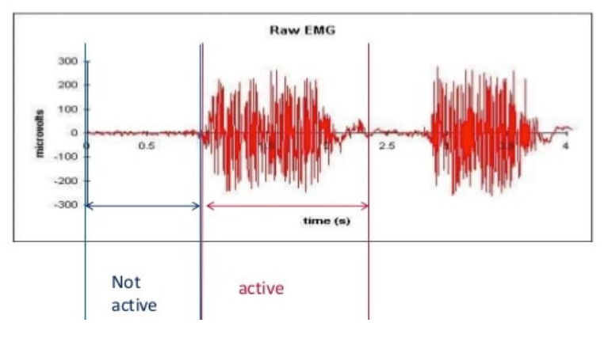


Linked to the sensor via 3,5 mm jack connector there is a cable which is connected on one side to Arduino, while on the other side ends with three snap connectors 
that attach to three electrodes.

Muscle Sensor v3 is used. It needs a positive and negative reference voltage so two 9V batteries are required.

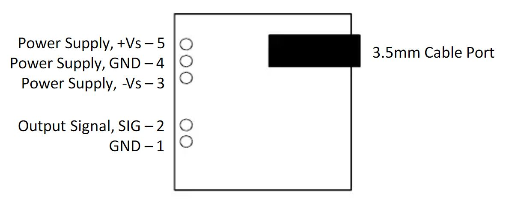

Surface EMG can be recorded by a pair of electrodes or by a more complex array of multiple
electrodes. More than one electrode is needed because EMG recordings display the potential
difference between two separate electrodes.

As you can read in the datasheet or in schematic, the two electrodes signal enter into an amplifier for instrumentation: 

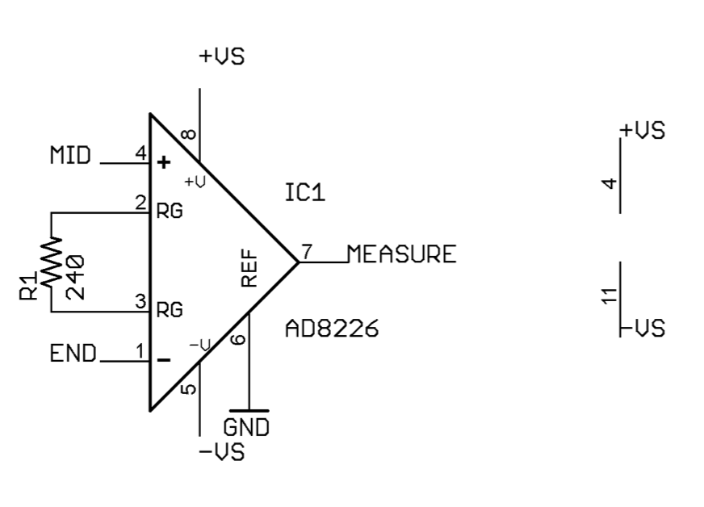


Subsequently the signal is rectified:

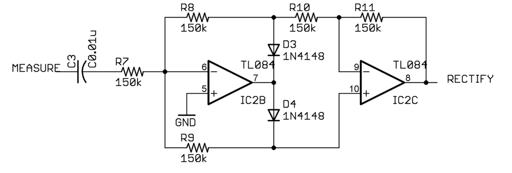


And finally it is smoothed:

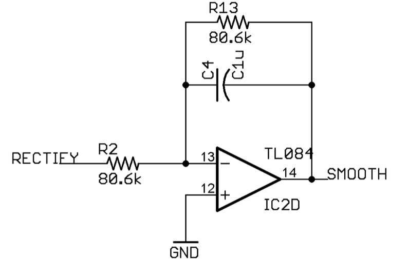

In summary we will have a variable signal with muscle contraction that will be sent to the Arduino A/D converter.

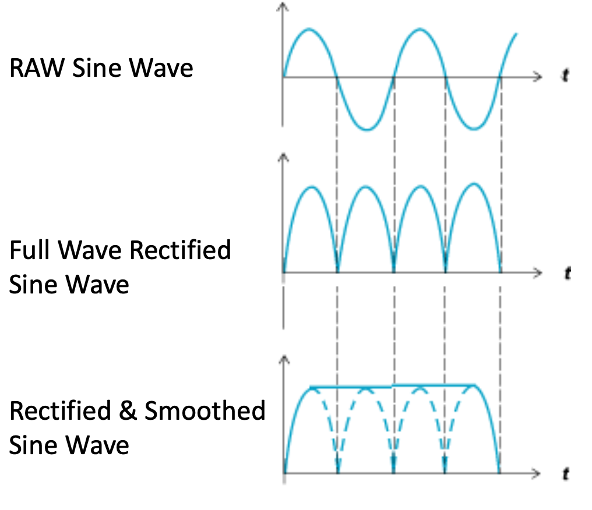


The muscelsensor V3 is discontinued so we have chosen a copy. This copy of the V3 allows a considerable saving however it has some defects. This sensor outputs a signal without smoothing and full of disturbs.

We also made a vectorial copy (`.svg`) that you can include in fritzing to easily draw the following schemes. This requires respecting the [fritzing standards](https://fritzing.org/learning/tutorials/creating-custom-parts) to design own parts. For more informations [this guide](https://learn.sparkfun.com/tutorials/make-your-own-fritzing-parts/all).


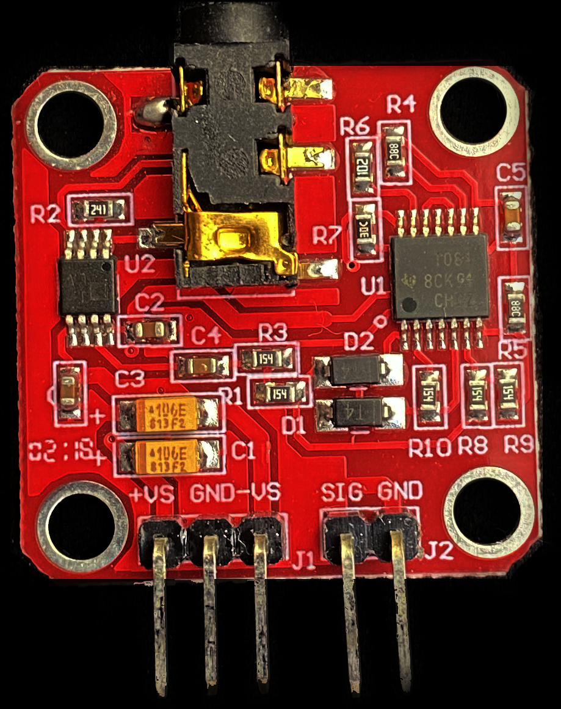 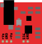


### EMG Electrodes
The electrical activity of a muscle is detected with the help of EMG electrodes. There are differente types of electrodes, surface EMG electrodes are used in this project, in particular the gelled one.
This type of elecrodes contains a gelled electrolytic substance as interface between electrodes and skin. 
Gelled EMG electrodes provide a non invasive technique for measurements and detection of EMG signal, but they are generally used for superficial muscles since they are applied on the skin. 
The EMG electrodes must be positioned appropriately. In particular two EMG electrodes should be placed between the motor unit and the tendinous insertion of the muscle, along the longitudinal midline of the muscle. The distance between the center of the two electrodes should be 1-2 cm. Red snap connector in the middle of muscle body and the green one at one end of the muscle body. 
The third electrode (yellow one) must be placed on an inactive section of the body.

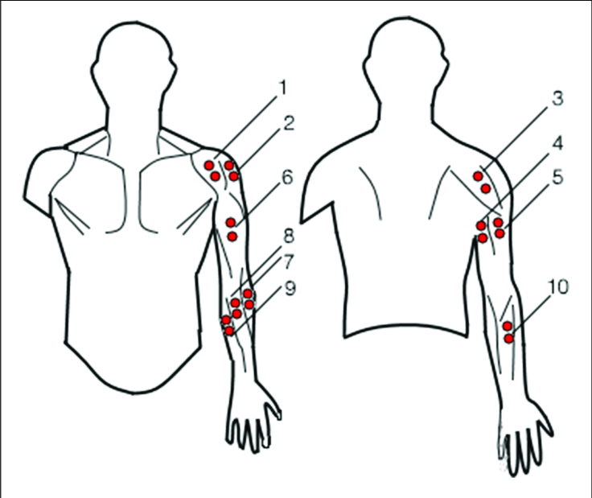

It is also important to do some considerations about emg signals.

The electrical source is the muscle membrane potential of about –90 mV. 
Typical repetition rate of muscle motor unit firing is about 7–20 Hz, depending on the size of the muscle
Measured EMG potentials range between less than 50 μV and up to 30 mV, depending on the muscle under observation. 
**It must be amplified !**

Due to the low quality of the emg circuit the analog signal was full of noise. The voltage was only rectified but not very leveled. So we provided to simple smoothing algorithm.

```c

int readings[numReadings];      // the readings from the analog input
int readIndex = 0;              // the index of the current reading
int total = 0;                  // the running total
int average = 0;                // the average
int inputPin = A0;              // EMG analog pin

void setup() {
    Serial.begin(9600);
  // initialize all the readings to 0:
  for (int thisReading = 0; thisReading < numReadings; thisReading++) {
    readings[thisReading] = 0;
  }
}


void loop() {
 
  total = total - readings[readIndex];          // subtract the last reading:
  readings[readIndex] = analogRead(inputPin);   // read from the sensor
  total = total + readings[readIndex];          // add the reading to the total:
  readIndex = readIndex + 1;                    // advance to the next position in the array:

  if (readIndex >= numReadings) {               // if we're at the end of the array
    readIndex = 0;                              // wrap around to the beginning
  }
  average = total / numReadings;                // calculate the average:
                                                // print different data for plotting
  Serial.print(average);
  Serial.print("\t");
  Serial.print(soglia);
  Serial.print("\t");
  Serial.println(analogRead(inputPin));
  delay(1);                                     // delay in between reads for stability
}
 ```


 This is the [Arduino's reference smoothing scritp](https://www.arduino.cc/en/Tutorial/BuiltInExamples/Smoothing/) with little changes made after a long period of testing.


 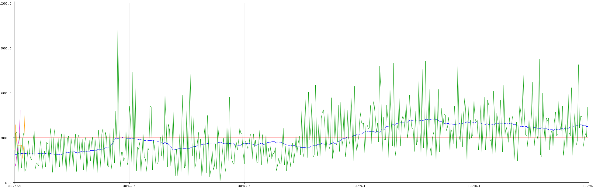

 > Smoothed signal (blue), original signal (green), threeshold (red). When the signal is below the threshold the arm is relaxed otherwise it is contracted.

 This smoothed `average` allows us to customize the following control code for the clamp servo.

 ```c
#include <Servo.h>
Servo servoclamp;
long t3 = 0;
long t4 = 20;
boolean controllo[10];
boolean stato;
int i = 0;
int soglia = 350; // Threeshold
// This value derives from a long period of testing. 
// You will need to do several tests 
void setup() {
  servoclamp.attach(5);
    // other code...
  }
 void loop() {
// other code..
  if (average > soglia) {
    servoclamp.write(max_servo_angle);// gripper closing
  }
  if (millis() - t3 < t4) {
    if (average < soglia) {
      controllo[i] = LOW;
    }
    else {
      controllo[i] = HIGH;
    }
    if (i < 10) {
      i++;
    }
    t3 = millis();
  }
    // only if the average is below the threshold
    // for a long time is it possible to close the clamp 
    // this allows to avoid problems due to sudden oscillations of the signal
  for (int j = 0; j < 10; j++) {      
    if (controllo[j] == LOW) {      
      stato = LOW;
    }
    else {
      stato = HIGH;
    }
  }
  if (stato == LOW) {
    servoclamp.write(min_servo_angle);   // gripper opening
  }
 }
 ```

### Pulse sensor 

The principle is to make a light shine between your fingers. Most of the light is absorbed or reflected, but some light will pass through our tissues if they are thin enough. When blood is pumped through your body, it gets squeezed into the capillary tissues, and the volume of those tissues increases very slightly. Then, between heart beats, the volume decreases. The change in volume effects the amount of light that will transmit through. This fluctuation is very small, but we can sense it with electronics. Here's how it's done.

We start with a light source and a light detector. Using an Infrared LED, and a photodiode sensor. It's important that the two devices are matched well, so that the light wavelength output from the LED is detected strongly by the photodiode (see below for part numbers). The photodiode is essentially a teeny tiny solar cell, just like the panels on rooftops, but really small. It will generate a small voltage and current when it is blasted with photons. The Infrared LED is what we will use for our photon blaster.

The next thing we need is a way to amplify the tiny signal coming off of the photodiode. Happily enough, the configuration of this circuit is well-known  as a 'Current to Voltage Converter' and it is a classic.

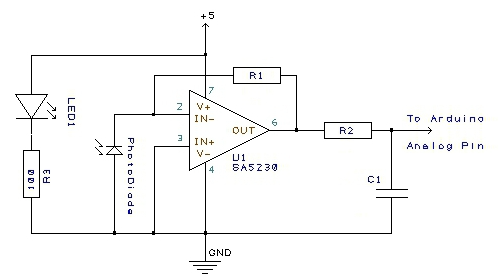

The photodiode needs to be shielded from ambient light, which generates alot of noise in the signal. 
The waveform here is usable, but as you can see, the pulse signal is distorted by even small movements. Also any misalignment or movement of the IR LED will muddy up the signal.


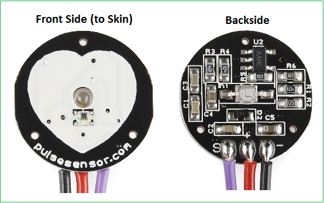

pulsesensor.com make a Pulse Sensor that is small enough to be worn comfortably in many configurations, and immune to signal noise generated by moving around, or changes in ambient lighting conditions.
They found a super small integrated circuit that has an on-board photodiode and op amp circuit combined. The super smallness means that we can maintain close, steady contact with the skin. This shields the sensor from changes in ambient light and makes noise from moving around minimal at most. 

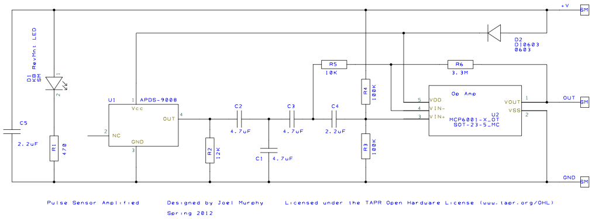

The raw signal looks like:

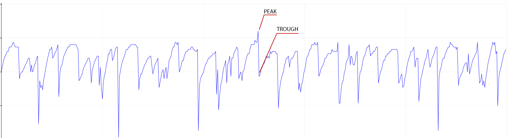

A first possibility is to use the library provided `PulseSensor Playground` , however this is not fully compatible with the other features we want to implement. So we proceeded to write a special code. 

Reading is callback by `battiti()` function described in the library `funzioniBPM.h`.

We have therefore put together several ideas from [instructables.com](https://www.instructables.com/circuits/howto/pulse+sensor/) and from [pulsesensor.com](https://github.com/WorldFamousElectronics/PulseSensor_Amped_Arduino/blob/master/PulseSensorAmped_Arduino_1.5.0/PulseSensorAmped_Arduino_1.5.0.ino) to obtain a code that takes care of reading the analog value and identifying the beat above a certain threshold. The code is relatively complex. 
Besides a part to print symbols or an affirmative sentence when the beat is actually detected.
Timer 2 is used to set an interrupt every 2 ms. a more complex piece of code takes care of measuring the time elapsed since the last beat and making appropriate samples to avoid noise. In particular, an attempt is made to avoid dichrotic noise and to reveal peaks. When a beat is detected (peak in compliance with the imposed conditions) the time value is updated and the BPM is calculated as well as the number of beats that can occur in 1 minute (60000 ms).

The main functions are performed by `ISR(TIMER2_COMPA_vect)` and `battiti()` and `serialOutputWhenBeatHappens()` take care of returning the beat values. 


### DS18B20 Sensor
DS18B20 is a digital temperature sensor, which is a sensor capable of measuring the temperature of the environment but also of the ground or to detect temperature in liquids. 
This sensor is available in several sizes, in this project it has been used the one inserted into a waterproof probe. The DS18B20 sensor is much more sensitive than the DHT11 
(temperature and humidity sensor) because it can reach 9 to 12 bit resolution. More with this module it is possibile to add multiple sensors on the same bus, each 
DS18B20 has a unique 64-bit serial code, which allows multiple DS18B20s to function on the same bus.
The protocol used is OneWire protocol which uses a digital pin, from which a bus starts and allows us to communicate with a specific device on the bus knowing the address.

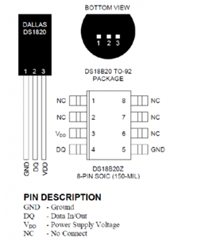

Two libraries are required, the first one is the DallasTemperature and the second one is the OneWire library. 

 ```c
#include <DallasTemperature.h>
#include <OneWire.h>
```

The DS18B20 was then discontinued due to an incompatibility of the library interrupts and the other functions. The temperature of the GY-521 was deemed to be sufficiently accurate.


### Sensor testing 

The following circuit shows the test setup for developing the initial code:

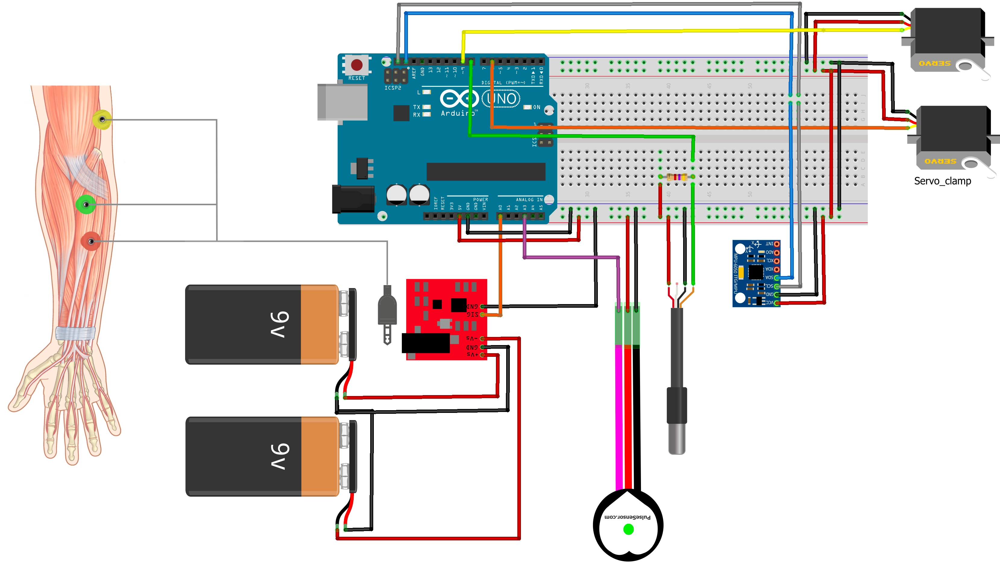

This configuration of two 9V DC power supplies allows you to have +9 and -9 on the Vs terminals.
It is also possible to use 18V DC power supply and split it in +9V and -9V.

This configuration allowed us to do all the device and code tests. We therefore reworked part of the code by dividing it into the various modules in order to have a more modular system that would allow you to add or remove devices as needed.
From this configuration we started to divide then into a structure determined for monitoring and a structure with actuators.

In the end the sensors that must arrive on the wrist will be joined in a single cable equipped with a connector to connect it to the monitoring structure. 

Everything will be reorganized in a more compact way

## Device division

At this point we have divided the code and the devices. We use an arduino nano to read the sensors and an arduino uno to control the servo motors.

Communication between the two is via radio using two NRF24L01 Single chip 2.4 GHz Transceiver.

### nRF24L01

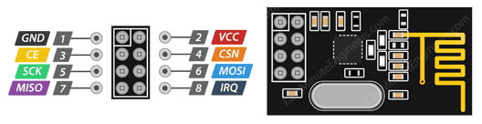

The device has an operating voltage of 1.9V ~ 3.6V, a built-in 2,4GHZ antenna and an operating speed (max) of 2 Mbps. 
The chip is managed by the SPI interface. Through this interface it is possible to access the registers of the chip and modify all its parameters.

This complex operation, however, is facilitated for us by libraries.

```c
#include <SPI.h>
#include <nRF24L01.h>
#include <RF24.h>
```

The connection requires several pins:
	
- GND
- Vcc, powers the module  using 3.3V
- CE, Chip Enable, used to enable SPI communication
- CSN, Ship Select Not, pin has to be kept high always, else it will disable the SPI
- SCK,Serial Clock, provides the clock pulse using which the SPI communication works
- MOSI. Master Out Slave In, Connected to MOSI pin of Arduino, for the module to receive data from the arduino
- MISO, Master In Slave Out,Connected to MISO pin of Arduino, for the module to send data from the Arduino
- IRQ, it is an active low pin and is used only if interrupt is required

To use the chip it is necessary to set reading or writing in `setup()`like:

```c
  radio.begin();
  radio.openWritingPipe(address); //for receiving 
//radio.openWritingPipe(address); // for trasmitting
  radio.setPALevel(RF24_PA_MIN);
  radio.stopListening(); //for receiving 
//radio.stopListening();// for trasmitting
```

It is also important to define Chip Enable `CE`and Ship Select Not `CSN`


For the transmission we used a function `charfortransmission()` created ad hoc that allows to concatenate a letter which indicates which data we are transmitting and the value assumed from the corresponding variable. this function is cycled in the `loop()` and continuously called by sending it different parameters depending on the variable. It is then converted into `char` to allow correct transmission with the libraries it uses. 
The receiver has a similar function `radionuovo()` that first analyzes the first character identifying what information is received and then enters the data in the variables of interest, after making the appropriate variable type conversions


### Arduino Nano for sensing 

> Configuration with Arduino nano and sensors on breadboard for testing


For the arduino dedicated to sensors, the circuit has been modified by adding an LCD display to monitor the parameters and an nRF24L01 for radio transmission. The LCD display is connected with an I2C interface module to simplify communication and cable management. The connection of the sensors has remained the same. The DS18B20 sensor has been temporarily excluded due to incompatibility between the libraries. We will decide later whether to include it again by changing the code. So the temperature of the GY-512 is used although not as accurate.

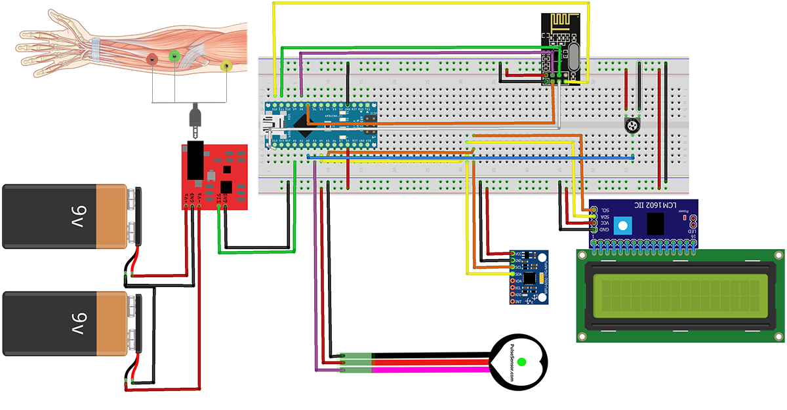

An arduino nano was used to make the whole thing more compact. The pin definition remains the same. It is important to remember that there are no dedicated SDa and SCL pins but they are on A4 and A5.

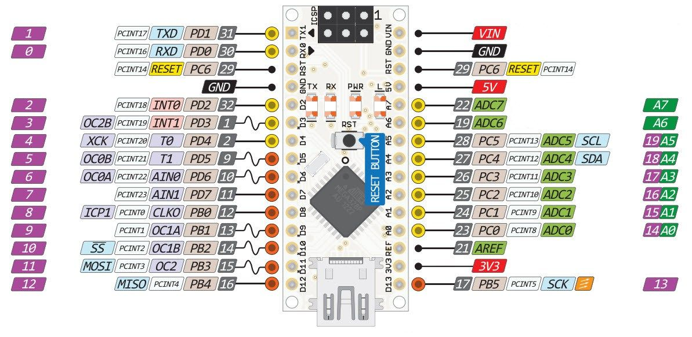


In the code the elements related to the servo motors have been removed and the rest has been rearranged.

The main code is as follows:

```c
#include <MPU6050_tockn.h>
#include <Wire.h>
#include "funzioniBPM.h" // battiti
#include "printerfunzioni.h" // stampante
#include "EMGsmooth.h" // lettura emg
MPU6050 mpu6050(Wire);
void setup() {
  Serial.begin(9600);
  Wire.begin(); // avvio e inizializzo il gyro
  mpu6050.begin();
  mpu6050.calcGyroOffsets(true);
  // mpu6050.setGyroOffsets(0, 0, 0);
  for (int thisReading = 0; thisReading < numReadings; thisReading++) {  // initialize all the readings to 0:
    readings[thisReading] = 0;
  }
  t1 = millis();
  interruptSetup();                 // sets up to read Pulse Sensor signal every 2mS
  lcd.begin(); // initialize the LCD
  lcd.backlight();
}
void loop() {
  average = averagecalc (); // calcolo media EMG
  mpu6050.update();
  tempmpu = mpu6050.getTemp(); // prende la temperatura
  angle = mpu6050.getAngleX(); // prende l'angolo lungo x
  printatore(LOW); // set HIGH to debug EMG with serial plotter
  lcdprint();
  battiti();
  charfortransmission("T", String(tempmpu));
  charfortransmission("A", String(angle));
  charfortransmission("M", String(average));
  charfortransmission("B", String(BPM));
  charfortransmission("S", String(soglia));
  delay(1);
}
```

This main code has been simplified by adding several functions that call external library definitions:
- ` averagecalc() ` has been defined in the `EMGsmooth.h` and is used to calculate the average of the distorted EMG signal
- `printatore(LOW)` it is a special function that can be used to print the EMG signal for the serial plotter in order to debug any problems with the detection. It is usually used to print all values ​​on the serial monitor. It is defined in `printerfunzioni.h`
- `lcdprint()` it is used to print the different values ​​and connected symbols on the LCD display
- `battiti()`it is used to reveal heartbeats and BPM. It has been defined in the `funzioniBPM.h`
- `charfotransmission()`to trasmitting data with relative informations

To maintain the code clear this function was defined in external libraries. 
The `EMGsmooth.h` library it's responsible of smoothing emg signal in order to obtain precision in threshold determination.
The `funzioniBPM.h` library has already been described in the pulse sensor paragraph.
The `printerfunzioni.h` contains the function to print in the serial monitor and in the lcd display. It also contains the definition of the LCD symbol as an arrow or heart.

To create special characters for LCD it is used  [LCD Custom Generator](https://maxpromer.github.io/LCD-Character-Creator/) that allow us to generate a byte custom char with pixel ON/OFF definition. This allows us to use special symbols in addition to ASCII characters by individually defining the on and off pixels in an 5x8 matrix (`byte_matrix`). It is possible to create up to 8 different symbols with the `createChar ()` function of the LiquidCrystal library and print them with `lcd.Write()`. For example for heart symbol:

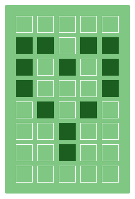

```
byte heart[] = {
  B00000,
  B11011,
  B10101,
  B10001,
  B01010,
  B00100,
  B00100,
  B00000
};
lcd.createChar(1, heart);
lcd.setCursor(6, 0);
lcd.write(1);
```


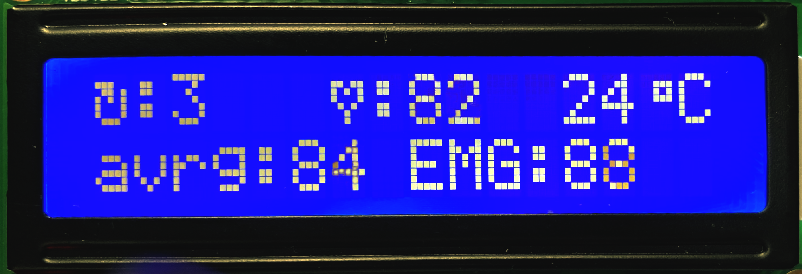

Each library contains all the variables and all the other libraries necessary for their operation. 

We are therefore able to obtain the following values ​​which must be contained to the arduino with the actuators:

- `tempmpu`
- `angle`
- `average`
- `BPM`
- `soglia`

Finally, a trimmer was also added to manually adjust the threshold on the analog pin A2.


### Arduino Uno for execution

> Configuration with Arduino Uno, servomotors, radio trasmitter and clamp  for testing


This second structure takes care of receiving the radio signals and retransmitting them via bluetooth (or via serial) and to move the two servomotors.
It is important to note that a logic level converter (3.3V 5V TTL) was used to add the bluetooth module.

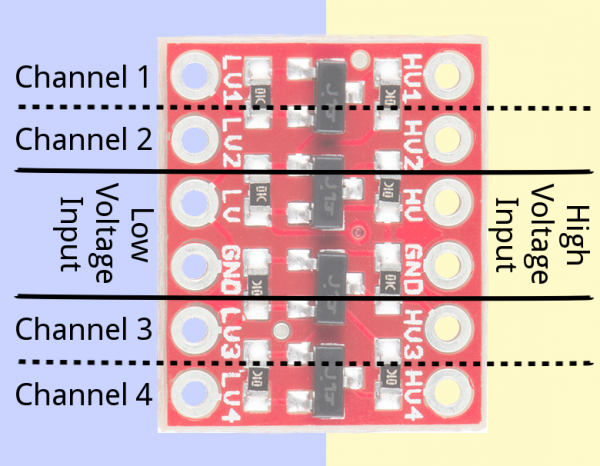

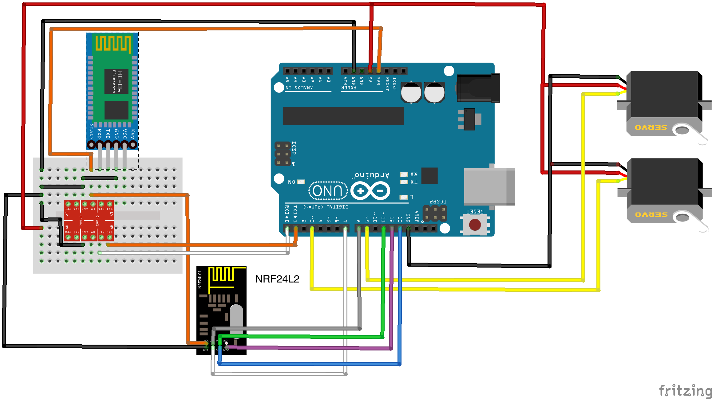


#### HC-06 for bluetooth

The hc-06 module is a device that allows you to transform a signal on the serial bus into a bluetooth signal. 

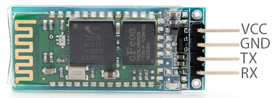

Typically is used a software serial protocol to communicate however we use directly the UART bus on pin tx and rx.
So we created two new functions `radioperbt()` and `decodeserial()`.
The first one analyzes the char received from the nRF24 and according to the first letter updates the respective variable and at the same time prints the value encoded in the serial (so also in bluetooth).
The second one instead deals with analyzing the commands received. Therefore whether manual control is active or not and, if necessary, the rotation angles of the servomotors. It will be better described in the GUI section.

`radioperbt ()` was originally written as a function to decode the radio message and update variables (`radionuov ()`). Then it has been updated in order to allow bluetooth communication by sending the message encoded with the first letter that indicates which variable corresponds to the data.
```c
if (text[0] == 'T') {
      Serial.print("T");
      valore = "";
      for (int i = 1; i < 32; i++) {
        valore = valore + String(text[i]);
      }
      tempmpu = valore.toFloat();
      Serial.println(tempmpu);
    }
```
The logic is to receive an `array chart`, analyze the first char and convert all the others to the variable of interest (`float` or `int`) and print the message again as a encoded `String`.

#### Servo motors

Two functions have been created to control the servomotors.

`pos_servo()` to which we pass the inclination and takes care of remapping it correctly to rotate the structure.

`pinzacontrol()` which takes care of deciding whether or not to close the clamp according to the threshold value. There is a further check before reopening the clamp to avoid problems due to signal fluctuations.
```c
if (average > soglia) {
    servopinza.write(pinzamax);// chiudo la pinza
  }
if (millis() - t3 > t4) {
  if (average < soglia) {
    controllo[i] = LOW;
  }
  else {
    controllo[i] = HIGH;
  }
  if (i < 10) {
    i++;
  }
  t3 = millis();
  }
for (int j = 0; j < 10; j++) {
  if (controllo[j] == LOW) {
    stato = LOW;
  }
  else {
    stato = HIGH;
  }
}
if (stato == LOW) {
  servopinza.write(pinzamin);// apriamo la pinza
}
  
```

## GUI

We also found it useful to develop a graphical user interface that allow you to view data or take control of the clamp, both from a computer and from a smartphone.


### Processing and computer app

To develop computer app we use Processing, compatible with MacOs, Windows and Linux.

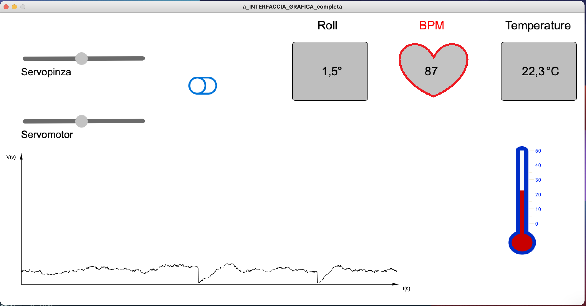

#### Sliders

In order to control the clamp and the other servo used in this project two sliders have been created on Processing. 
The first sketch created was the one on Arduino, in particular we have used a library which is called Firmata. Firmata is a library that implements the Firmata protocol for standard communication, to make Arduino or more generally a hardware device communicate with various types of peripherals or programs. 
In this project it was used to make Arduino at the service of an external software that is Processing itself. 
In the example section of the Arduino IDE we called ServoFrimata which is one of the example programs that supports as many servos as possible using the Servo library. 
Once the example was opened, it was compiled and uploaded to Arduino. This meant that Arduino could be interfaced by using this comunication protocol with any other software, program o device with the same protocol like Processing.

The code is as follows:

```c
#include <Servo.h>
#include <Firmata.h>

Servo servos[MAX_SERVOS];
byte servoPinMap[TOTAL_PINS];
byte servoCount = 0;

void analogWriteCallback(byte pin, int value)
{
  if (IS_PIN_DIGITAL(pin)) {
    servos[servoPinMap[pin]].write(value);
  }
}

void systemResetCallback()
{
  servoCount = 0;
}

void setup()
{
  byte pin;
  Firmata.setFirmwareVersion(FIRMATA_FIRMWARE_MAJOR_VERSION, FIRMATA_FIRMWARE_MINOR_VERSION);
  Firmata.attach(ANALOG_MESSAGE, analogWriteCallback);
  Firmata.attach(SYSTEM_RESET, systemResetCallback);
  Firmata.begin(9600);
  systemResetCallback();
  // attach servos from first digital pin up to max number of
  // servos supported for the board
  for (pin = 0; pin < TOTAL_PINS; pin++) {
    if (IS_PIN_DIGITAL(pin)) {
      if (servoCount < MAX_SERVOS) {
        servoPinMap[pin] = servoCount;
        servos[servoPinMap[pin]].attach(PIN_TO_DIGITAL(pin));
        servoCount++;
      }
    }
  }
}

void loop()
{
  while (Firmata.available())
    Firmata.processInput();
}
```

In order to use the Firmata protocol on Processing, besides the serial library which is present by default on Arduino, it is necessary to import a library provided by Arduino which includes an Arduino equivalent software object, which represents the physical arduino connected via USB cable to the computer.

```js
import processing.serial.*;
import cc.arduino.*;
Arduino arduino;
Serial serial;
```

No dedicated libraries have been loaded to create the sliders. In fact the elements that create the slider have been drawn with another program and then added as images inside the program folder.

The images were then loaded into the code in this way:

```js
  barra1 = loadImage("barra1.png");
  indicatore1 = loadImage("indicatore1.png");
  barra2 = loadImage("barra2.png");
  indicatore2 = loadImage("indicatore2.png");
```
And than the images were placed on the window:

```js
  image(barra1, x1, y1);
  image(indicatore1, x2, y2);
  image(barra2, x1, y3);
  image(indicatore2, x4, y4);
```

So when the mouse moves along the x coordinate for the length of the slider in the upper half of the graphic window, the symbol which represents the indicator, will follow the mouse simulating the function of the slider. 
While when the muose moves along the x coordinate for the lenght of the slidere in the lower half of the graphic window, the indicator of the second slider will follow the mouse.
Then according to the position of the mouse the `servoWrite` function writes a value to the servo telling to go to the corresponding angle ranging from 0 to 180 degrees.

The code is as follows:

```js
...
if (mousePressed && mouseY < y1+20) {
      float targetX1 = constrain(mouseX, 100, 380);
      float dx = targetX1 - x2;
      x2 += dx * easing;
      arduino.servoWrite(5, constrain(mouseX / 2, 0, 180));
  }
 if (mousePressed && mouseY > y4-10) {
      float targetX2 = constrain(mouseX, 100, 380);
      float dx = targetX2 - x4;
      x4 += dx * easing;
      arduino.servoWrite(9, constrain(mouseX / 2, 0, 180));
  }
  ```
 
 Below the graphic window with the created sliders:
  
  
  
#### Graphic

In order to view the data coming from the EMG we have created a graph on Processing in which we can see the trend recorded by the EMG.
To improve the code we have created multiple classes, so that the main sketch is more compact. For the graph we have `public class Grafico`.
to build the graph the axes were drawn first, by using the function `line(x1, y1, x2, y2)`, the values contained inside indicate the position in which the graph has been placed and also the length of the x and y axes which represents respectively the time t(s) and the amplitude V of the oscillations of the EMG.

Inside `public void setdat()` we define an array of 1000 elements and through a for cycle we have access to the element of the array which are the values from the EMG remapped between 0 and 300 (which corresponds to the height of the y axis). Then we define another array which contans as much element as the previous one, again we access to the elements through a for cycle and we define a float variable called `passo` which is the length of the x axis divided by the float variable `data.lenght`. So the value assumed by the elements of the `datax[i]` array is 50 + i * passo.
the code is as follows:

```js
public class Grafico {
public float[] datax; 
 public Grafico(){}
 
 public void setdati(){
 data = new float[1000];
  for (int i=0; i < data.length; i++) {
    data[i] = 100;
  }
  datax = new float[data.length];
  for (int i=0; i < datax.length; i++) {
    float passo=900/float(data.length);
    datax[i] = 50+i*passo;
  }
 }
```  
So once we have defined the relationship between the data received and the x axis we can draw the line which allows us to view the trend of the values detected by the EMG with `line(datax[i], 650-data[i], datax[i+1], 650-data[i+1])`. Once the curve reaches the end of the x axis restart from the origin. 
The direction of the axes indicated by the tip of an arrow and have been created with the triangle function in which the six values represents the position of the three vertices of the triangle.

```js
public void assi(){
 for (int i=0; i<data.length-1; i++) {
    fill(55, 200, 50);
    line(datax[i], 650-data[i], datax[i+1], 650-data[i+1]);
  }


  stroke(0, 0, 250);
  strokeWeight(2);
  //line(50,800-V,950,800-V);
  stroke(0, 0, 0);
  line(50, 350, 50, 650);
  line(50, 650, 950, 650);
  fill(0, 0, 0);
  triangle(48, 350, 52, 350, 50, 340);
  triangle(940, 648, 940, 652, 950, 650);
  textSize(12);
  text("t(s)", 965, 665);
  text("V(v)", 15, 350);
 }
``` 
#### Icon

The icon was added in order to switch the command so that it is possible to control the clamp with the sliders. The switch allows us to switch to manual control. In order to create the switch we have used the Cp5 library which contains the switch among the examples.
it was therefore necessary to import the library:

```js
import controlP5.*;
ControlP5 cp5;
``` 
In the `public class Serialcomunication extends Grafico` we created a function `serialsend()` in which if the manual control is active (`if (pulsante == true)`) and if the mouse is pressed and it is in correspondence with one of the sliders, we can open-close the gripper or rotate it by mapping the position on the slider in the range between 0° and 180° for the gripper and between -90° and 90° for the rotation. Then this value is written as String together with an identification character to the serial port.
the code is as follows:

```js
...

 void serialsend() {
    if (mousePressed) {
      if (millis()-ti>500) {
        if (pulsante==true) {
          if (mousePressed && mouseY < y2+20) {
            float pinzamap=map(target1, 50, 350, 0, 180);
            String pinza="P"+str(pinzamap);
            MyPort.write(pinza);
            println(pinza);
          }
        }

        ti=millis();
      }
      if (millis()-ti2>500) {
        if (pulsante==true) {
          if (mousePressed && mouseY > y4-20) {
            float rotazmap=map(target2, 50, 350, -90, 90);
            String rotaz="R"+ str(rotazmap);
            MyPort.write(rotaz);
            println(rotaz);
          }
        }
        ti2=millis();
      }
    }
  }
  ...
  
``` 
If we click on the icon which has the value “false” by default we give the value `true` and the string `"C1"` is sent on the serial, otherwise if the value is `false` the string `"C0"` is sent on the serial. When the string `"C1"` is read from the serial the boolean variable `controlloapp` is seto to 1 so that the movements of the gripper will be managed by the sliders. 
Instead if the string `"C0"` is read from the serial the Boolean variable `controlloapp` is set to 0 so that that the movements of the gripper will be managed by values received from the inertial sensor and the emg sensor which means that the manual control is disabled.
```js
void icon(boolean theValue) {

  println("got an event for icon", theValue);
  if (theValue == true) {
    MyPort.write("C1");
    pulsante=true;
  }  
  if (theValue == false) {
    MyPort.write("C0");
    pulsante=false;
  }
} 
``` 
We have created virtual displays to read the values coming from the sensors. In particular one for the beat, one for the inclination of the gripper, one for the temperature and for the temperature we also drew a thermometer.
Let’s start with the beat.

#### Bpm

To view the beat we imported the image of a heart inside which the value is written. As for the images used for the sliders we first loaded the image, previously saved in the program folder, and than we pasted it with the `image()` function.
The continuously updated value of the beat derives from the `text()` function in which as string we have inserted `nfn(Batt, 0)` which transforms the float variable `Batt` containing the values of the beats transmitted via bleutooth by the Arduino Uno into a String, with 0 digit to the right of the decimal point.
```js
public void cuore(){
        battitook = loadImage("battitook.png");

  }

...
public void battito (float Batt){
  textFont(font24); 
  fill(250, 0, 0); 
  text("BPM", x1+xshift+950, y1-10); 
  fill(0, 0, 0);
  image(battitook, x1+900, y1+20);
  text(nfc(Batt, 0), 1017, 150);
  }

```

#### Roll

In the icon called Roll we have reported the values of the inclination of the gripper. We simply created a rectangle with the `rect()` function inside which we entered the value in the same way as for the beat, this time using the float variable `float Incl`.
```js
public void inclinazione(float Incl) {
    fill(190);
    stroke(0);
    strokeWeight(1);
    rect(700, 70, 180, 140, 7);
    fill(0, 0, 0);
    textFont(font24);
    text("Roll", 760, 40);
    text(" °", 800, 150);
    text(nfc(Incl, 1), 770, 150);
  }

```
Exactly the same thing was done for the rectangle in which the temperature value is reported, obviously with the appropriate variable and for this we omit the corresponding code.

#### Thermometer

In order to create the thermometer the bulb was drawn first with the function `ellipse()` which draws an ellipse with center X,Y and semi-axis equal to width and height. The bulb is filled with mercury so it has been colored with shade of red.
Then you have to draw the thermometer which is given by the union of an arc and a rectangle so we have used the functions `arc()` and `rect()`. The function  `arc()` contains different values, in order we have the X and Y position of the center, the width and the height but also the start angle and the end angle. 
Once the bulb and the thermometer are built the inside of the thermometer is filled with mercury. In order to build the mercury column that signals the detected temperature it has been use the function `map(tempC, 0, 50, 0, 175)` which maps che temperature between 0 and 50 degrees in the height of the graduated scale. 
`h = -y-66` is the offset between the zero and the bulb. 

The code is as follows:

```js
public class Termom {
  float y, h;
  
  public Termom() {
  }
  //Disegno termometro
  public void bulbo() {
    // Bulbo
    fill(200, 0, 0);
    smooth();
    stroke(0, 46, 200);
    strokeWeight(8);
    ellipse(1250, 550, 58, 50);
  }

  public void termometro() {
    //Termometro
    noStroke();
    fill(0, 46, 200);
    arc(1250, 330, 30, 20, PI, PI+PI);
    rect(1235.2, 330, 30, 200);
  }

  public void mercurio() {
    // Disegno solco mercurio
    fill(250, 250, 250);
    rect(1245, 330, 10, 200);
    
    // Mercurio
    fill(200, 0, 0);
    smooth();
    strokeWeight(0);
    float y= map(tempC, 0, 50, 0, 175); 
    h = -y-66; 
    rect(1245.2, 570, 10, h);
  }
```
The centigrade scale was also added. In particular a large notch has been added every ten degrees and a smaller one halfaway between the two large notches. 
The notches have been drawn with the `line()` command. 

#### Bluetooth decode 

Bluetooth performs two important functions.
The first one involves the manual control switch. 

When the switch is activated a command coded `Cx` is sent. `x` represents the state of the system. If it is `1` then the control will be manual otherwise it will be left to the sensors.

In addition to sending this command, the angular values ​​for the servomotors are sent which will be received, decoded and implemented by the functions `pos_servo2(angle)`and `pinzacontrol2(angle)` in the servo motors structure. 
To send these commands there is a double check by checking the mouse pressed on the slider coordinates and by a non-blocking timer to avoid errors in the receiving serial buffer.

```js
if (millis()-ti>500) {
        if (pulsante==true) {
          if (mousePressed && mouseY < y2+20) {
            float pinzamap=map(target1, 50, 350, 0, 180);
            String pinza="P"+str(pinzamap);
            MyPort.write(pinza);
            println(pinza);
          }
        }

        ti=millis();
      }
```
Rotation is remapped and coded with `P` for the gripper and `R` for angular rotation.

The other important function is to receive temperature, rotation and electromyography data

To do this `serialreceive()` function was implemented.

```js
 if (MyPort.available() > 0) {
      dati = MyPort.readStringUntil('\n');
      dati=dati.trim();
    }
    dativec=dati.charAt(0);
    if (dativec == 'T') {
      valore = "";
      for (int i = 1; i < dati.length(); i++) {
        valore = valore +dati.charAt(i) ;
      }
      tempC = float(valore);
    }
// ecc.
```

This function checks for input data and converts it to a `char array`. Then check the first element to decode the data, convert the value to a number (`float` or `int`) and update the variable.

#### Code 

To make the code more readable and functional, various classes have been created containing the various graphic and functional elements.
There are different classics for:

- Thermometer 
- Virtual screens for data visualization
- Slider
- Serial and bluetooth comunication
- Switch controll 
- EMG chart

The various classes are linked in order to pass the most important variables to each other.

Within each class various objects have been created to implement the various functions. 
It is very interesting, for example, how these three different objects are called up in the data visualization class:

```js
  schermo.temperaturadigitale(tempC);
  schermo.inclinazione(Incl);
  schermo.battito(Batt);
```

To draw and update the three virtual displays.

This allowed us to obtain a much more opulent and organized final code. The code is as follows:

```js
import controlP5.*;
ControlP5 cp5;
import processing.serial.*;
Serial MyPort;
float target1;
float target2;
PFont font24;
PFont font12;
boolean pulsante=false;
float tempC = 0;
float Incl = 0;
float Batt=0;

Termom termom= new Termom(); 
Schermo schermo=new Schermo();
Slider slider=new Slider();
Serialcomunication serialcomunication=new Serialcomunication();
Switchcommand switchcommand = new Switchcommand();
Grafico grafico = new Grafico();

void setup()
{
  size(1400, 700);
  background(255);
  MyPort =  new Serial(this, "/dev/tty.HC-05-SerialPort", 9600);
  grafico.setdati();
  cp5 = new ControlP5(this);
  switchcommand.setup();
  schermo.cuore(); 
  slider.sliderset();
}

void draw()
{
  background(255);
  serialcomunication.serialreceive();
  grafico.assi();
  termom.disegna();
  slider.slider1();
  slider.slider2();
  schermo.temperaturadigitale(tempC);
  schermo.inclinazione(Incl);
  schermo.battito(Batt);
  serialcomunication.serialsend();
}

void icon(boolean theValue) {
  println("got an event for icon", theValue);
  if (theValue == true) {
    MyPort.write("C1");
    pulsante=true;
  }  
  if (theValue == false) {
    MyPort.write("C0");
    pulsante=false;
  }
} 
```
### Python app 

Another possibility is to use Python to develop the application. Python is a more "high level" programming language than most other languages, object oriented, suitable for working quickly and integrating different systems.


The [Pyserial](https://pyserial.readthedocs.io/en/latest/#) library for serial communication comes in handy.

To easily develop the graphical interface we relied on [Tkinter Designer](https://github.com/ParthJadhav/Tkinter-Designer) which allows us to convert a design made with [Figma](https://www.figma.com) with drag and drop into a python snippet. 
We started by simply devising the main window design:

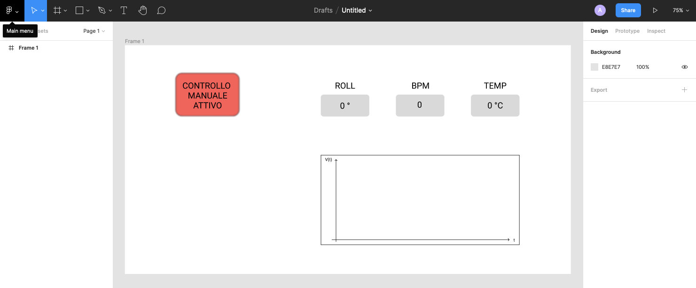

Then we modified the various blocks manually by introducing the labels and the whole part.

To insert the sliders we have created a Frame in which we have inserted the two sliders. We have inserted all of them with the `.pack ()` method:

```py
win = Frame(window)
win.pack(side =LEFT,fill=None, expand=False)
spinza = Scale(win, from_=0, to=180,orient=HORIZONTAL,command=spinza_changed)
spinza.pack(side=BOTTOM, padx=120, ipadx=60)
spinza.set(90)
sroll = Scale(win, from_=0, to=180,orient=HORIZONTAL,command=sroll_changed)
sroll.pack(side=BOTTOM, pady=100,  ipadx=60)
sroll.set(90)
```

And to send data:
```py
def spinza_changed(event):  #viene attivata quando varia lo slider spinza
    time.sleep(0.3) #aspettano 100 ms per evitare di stampare tutti i valori dello slider che si muove
    print("P"+str(spinza.get())) #stampa codificata
    if (bottone==False): #solo se sono in controllo manuale
        #invio i dati sulla seriale convertendoli in un byte (aggiungo anche i fine riga)
        #sfrutto la codifica concatenando P, il valore degli slider e i fine riga
        #byte con codifica utf-8
        arduino.write(bytes("P"+str(spinza.get())+"\r\n", 'utf-8'))
    
def sroll_changed(event):  #viene attivata quando varia lo slider sroll
    time.sleep(0.3) #aspettano 100 ms per evitare di stampare tutti i valori dello slider che si muove
    print("R"+str(sroll.get())) #stampa codificata
    if (bottone==False): #solo se sono in controllo manuale
        arduino.write(bytes("R"+str(sroll.get())+"\r\n", 'utf-8')) #invio i dati sulla seriale (vedi fz precedente)
```

The control button is actually fake as it consists of two images that are interchanged:
```py
img0 = PhotoImage(file = f"img0.png")
img1 = PhotoImage(file = f"img1.png")
b0 = Button(
    image = img0,
    borderwidth = 0,
    highlightthickness = 0,
    command = btn_clicked,
    relief = "flat")
b0.place(
    x = 143, y = 79,
    width = 180,
    height = 123)
```

```py
def btn_clicked(): #fz per aggiornare il pulsante, viene richiamata quando cliccato
    global bottone #utilizzare variabili globali
    # print("Button Clicked") 
    if (bottone): #siamo in controllo automatico5
        b0.config(image = img1) #aggiorna l'imm in rosso
        print("C1") #per cambiare modalità su arduino
        arduino.write(b'C1\r\n') #invio i dati sulla seriale convertendoli in un byte (aggiungo anche i fine riga)
    elif (bottone==False): #se siamo in controllo manuale
        b0.config(image = img0) #aggiorna l'imm in grigio
        print("C0") #per cambiare modalità su arduino
        arduino.write(b'C0\r\n') #invio i dati sulla seriale convertendoli in un byte (aggiungo anche i fine riga)
        #reset degli slider
        spinza.set(90)
        sroll.set(0)
    bottone=not(bottone) #cambia lo stato quando viene premuto il pulsante
    # print(bottone)
```

To receive data continuously, an `arduinoreceive()` function has been added, called by an `.after` method within a label that is continuously updated. This function is called at the end of the code for the first time. 
We start by initializing the serial:

```py
import serial
arduino = serial.Serial(porta, 9600)
```
The function reads the variables of the graph (which we will talk about later) and the position indices. Starts by deleting the graph to update it and goes to read the text on the serial `.readLine()`.
It converts the received text as a byte and checks the first letter to decode the value. It then updates the labels `.itemconfigure(label_name,text=testo.replace('T', '')+" ° C")` or values for the chart. Inserting the values the replace function deletes the encoding letter.
To update the graph values, the index is increased every lap. Then it is drawn.

```py
def arduinoreceive(): #funzione per ricevere
    #importo i grafici per poterci lavorare
    global a
    global b
    #resetto il grafico cancellandolo
    canvas.delete(a)
    canvas.delete(b)
    #importo gli indici per poterci lavorare
    global indicem
    global indices
    testo= arduino.readline() #legge la riga
    testo=testo.rstrip() #elimina i caratter '\r\n'
    testo=testo.decode("utf-8")  #utilizza la codifica corretta
    #print(testo)
    canvas.itemconfigure(grafico,fill='white') #aggiorno lo sfondo del grafico
    canvas.itemconfigure(text,text=str(testo)) #aggiorna l'etichetta per il debug
    window.after(50, arduinoreceive) #quando cambiano le etichette richiama la funzione creando un loop
    #iniziamo la decodifica
    if testo[0]=="T":
     #   print("Temperatura = "+testo.replace('T', ''))
        canvas.itemconfigure(temp_label,text=testo.replace('T', '')+" ° C")
    if testo[0]=="A":
     #   print("Angolo = "+testo.replace('A', ''))
        canvas.itemconfigure(roll_label,text=testo.replace('A', '')+" °")
    if testo[0]=="B":
     #   print("Bpm = "+testo.replace('B', ''))
        canvas.itemconfigure(bpm_label,text=testo.replace('B', ''))
    if testo[0]=="M":
        #vado ad aggiornare il valore corrispondnete all'ordinata del grafico
        #utilizzo la funzione mappa per mappare nell'intervallo corretto passandogli il testo senza il primo carattere
        data_m[indicem]=mappa(testo.replace('M', ''))
     #   print(f"data_m{indicem}]="+str(data_m[indicem]))
      #  print(indicem)
        indicem+=1 #incremento l'indice
    if testo[0]=="S":
        data_s[indices]=mappa(testo.replace('S', ''))
        indices+=1
        #disegno il grafico della media (average) unendo le coordinate di tutti i punti
    a=canvas.create_line( 'SEE LATER' )
    #disegno il grafico della soglia unendo le coordinate di tutti i punti
    #questo grafico NON viene attualmente utilizzato in quanto non vengono aggiornati i valori
    b=canvas.create_line( 'SEE LATER' )
    #se necessario resetto l'incremento dell'indice
    if indicem==rangemax:
        indicem=0
    if indices==rangemax:
        indices=0
```

The graph is constructed by joining 200 points whose coordinates are contained in the `datax` and `data_m` lists. These lists were created separately with the `vector.py` and `datilinea.py` scripts.

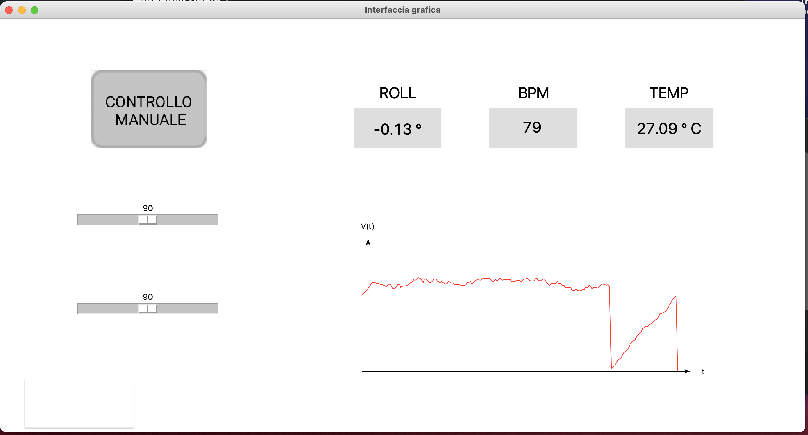

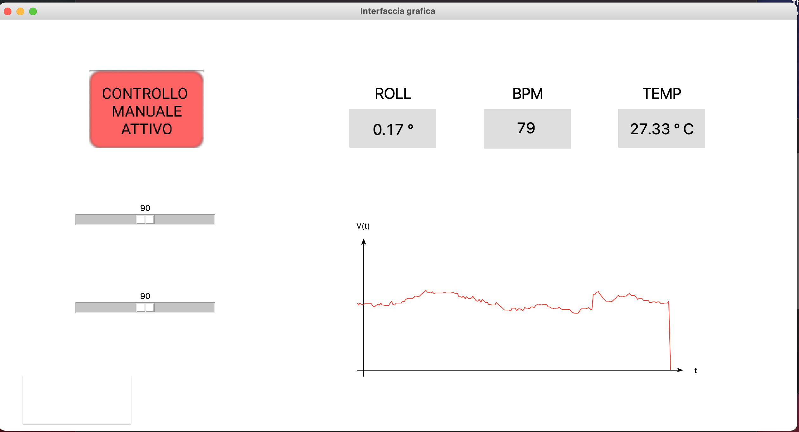


The sliders were created with the `Scale()` command and placed with `pack()`.

```py
spinza = Scale(win, from_=0, to=180,orient=HORIZONTAL,command=spinza_changed) #creiamo il widget con Scale
spinza.pack(side=BOTTOM,padx=120,  ipadx=60) #allineiamo lo slider e lo allarghiamo
spinza.set(90) #mettiamo l'indicatore al centro
slider1_label = ttk.Label(win,text=" CONTROLLO PINZA ",relief='groove',padding='3')
slider1_label.pack(side=BOTTOM)
#creiamo il secondo slider
sroll = Scale(win, from_=-90, to=90,orient=HORIZONTAL,command=sroll_changed)
sroll.pack(side=BOTTOM,  ipadx=60)
sroll.set(0)
slider_label = ttk.Label(win,text=" CONTROLLO ROTAZIONE ",relief='groove',padding='3')
slider_label.pack(side=BOTTOM)
```

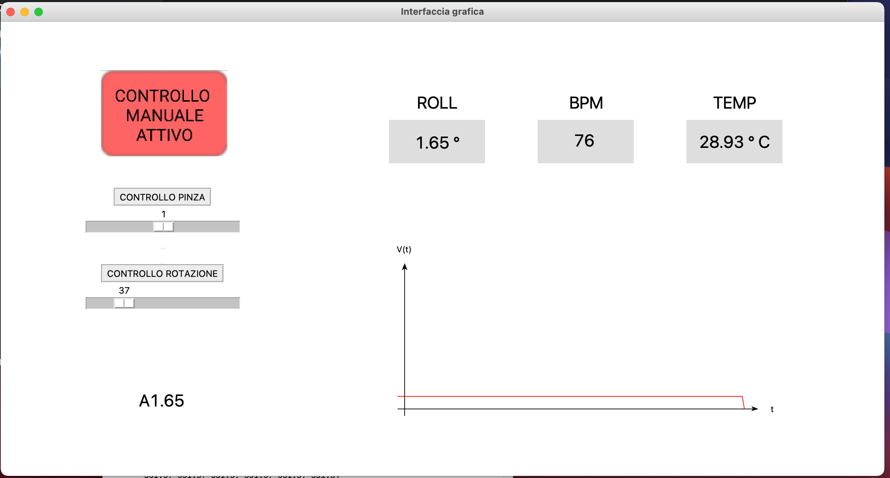


### Mobile app

To create application for smartphone has been used [MIT App Inventor](https://appinventor.mit.edu). App inventor allows us to develop a complete and functional app with an easy process however this application works only on Android devices. 

The functionalities are the same as those of the computer app integrated with portability and ubiquity of smartphone.  

To develop application the first thing to do is to add all the necessary components like list picker, label, slider, bluetooth client, clock and buttons. 

The Blocks have been created separately step by step. As follows is the result of the various tests performed. The graphic has been ultimated at the last. 

First of all it is necessary to create the structure that allows to select the bluetooth mac address of bluetooth module (HC-05).

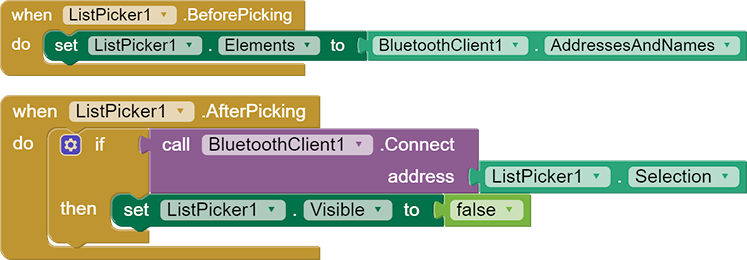

Then in order to change from automatic to manual control has been created a switch like block that send `C0`or `C1`with the same coding rules of processing app. 

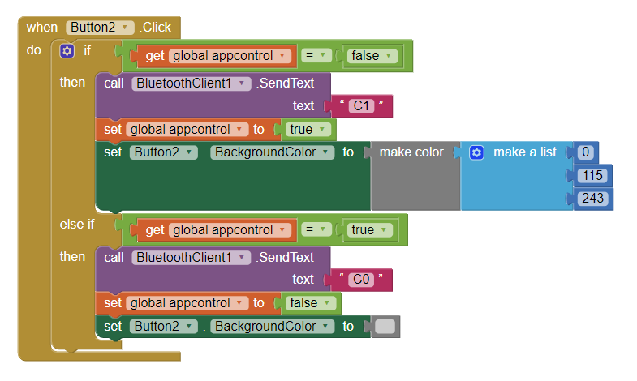

When manual control is on (`appcontrol == true`) it is possibile to send data. For example has been used the gyroscope of the smartphone to simulate the rotation of the clamp. 


To receive data it is necessary to request the availability of pipe and to save data in new variables.

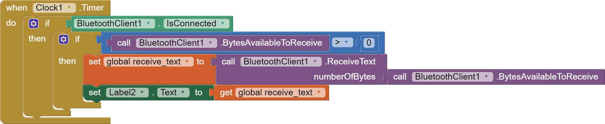


According to the type of the variables provided by App Inventor it has been necessary to split the string containing the received data into a `list`. This list `decode_text` contains different elements each of which represents a new codified upgraded data. Then each element has been analized by control the first character and saving the corrisponding value into the relative variable. 

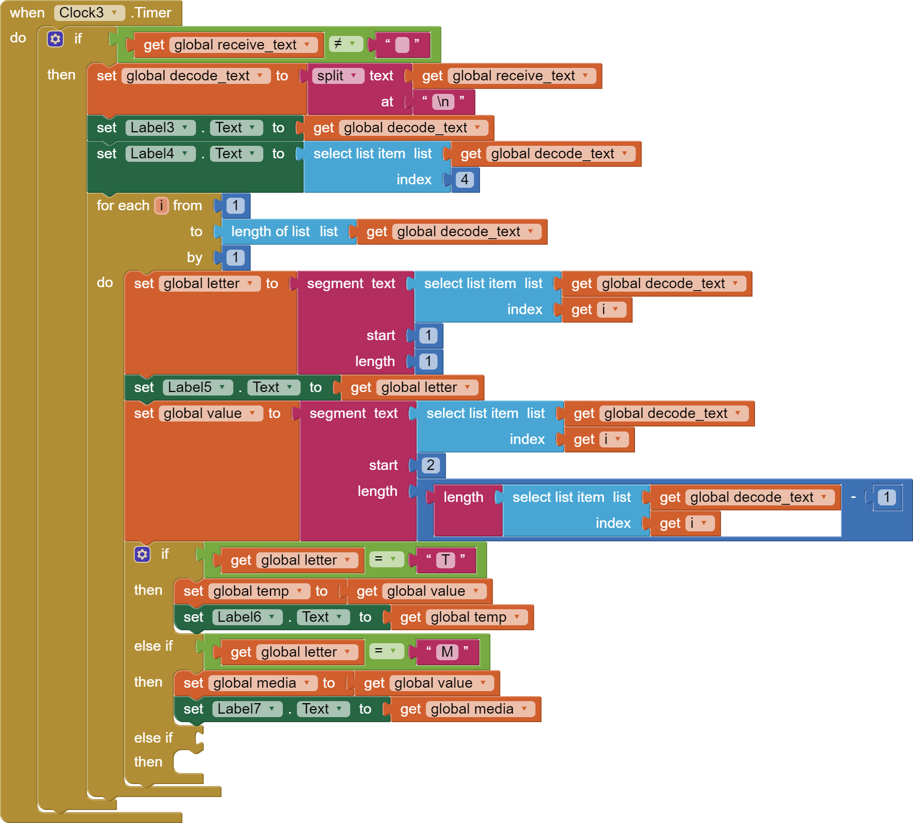

At this point has been used a test graphic interface to check that all works. 

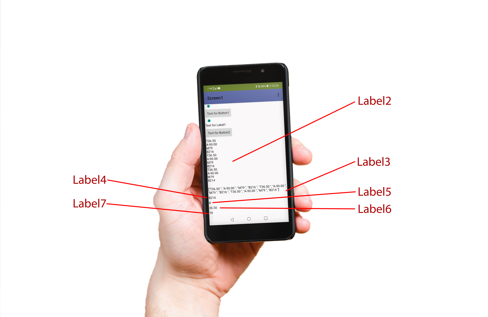

Graphic layout has been ultimated.

The final block structure:

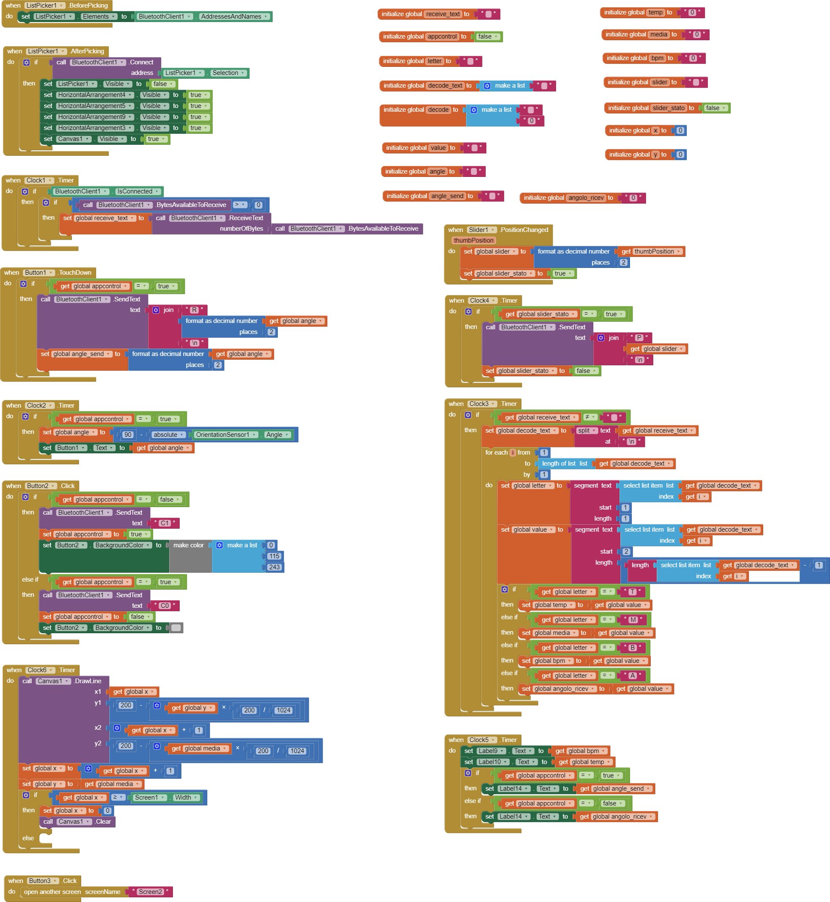

Final app layout:

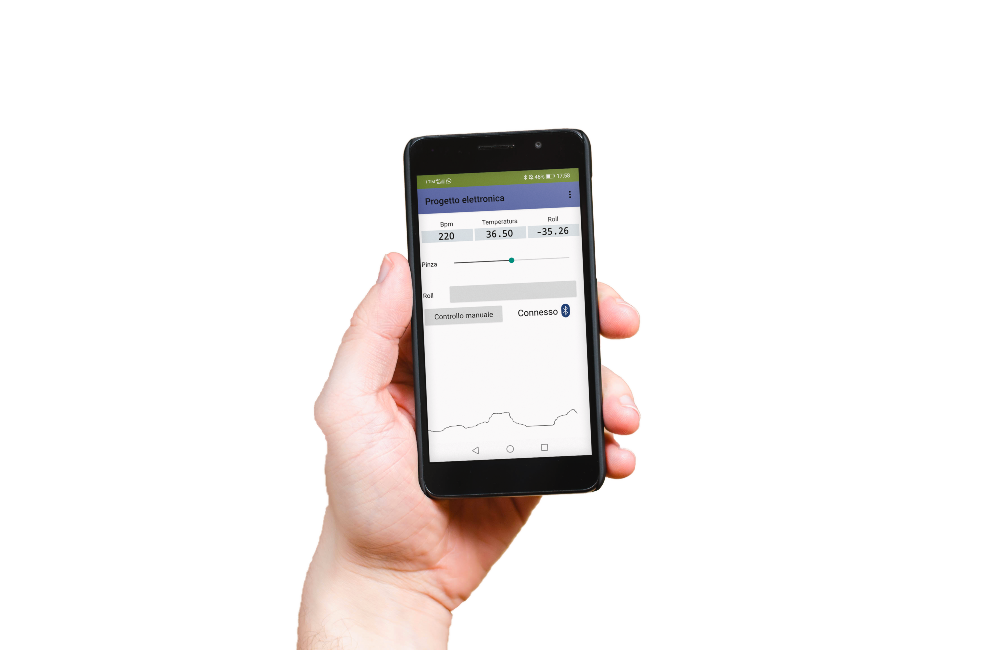

___

### iOS App 

To develop the application for devices with iOS mobile system it is first necessary to replace the bluetooth protocol with the BLE protocol. The Bluetooth Low Energy is independent of classic Bluetooth and has no compatibility, but they can coexists. BLE is intended to provide considerably reduced power consumption and cost while maintaining a similar communication range.
All Bluetooth Low Energy devices use the Generic Attribute Profile (GATT). The application programming interface offered by a Bluetooth Low Energy aware operating system will typically be based around GATT concepts. GATT has the following terminology:
- Client, a device that initiates GATT commands and requests, and accepts responses, for example, a computer or smartphone.
- Server, a device that receives GATT commands and requests, and returns responses, for example, a temperature sensor.
- Characteristic, a data value transferred between client and server, for example, the current battery voltage.
- Service, a collection of related characteristics, which operate together to perform a particular function. For instance, the Health Thermometer service includes characteristics for a temperature measurement value, and a time interval between measurements.
- Descriptor, provides additional information about a characteristic. 

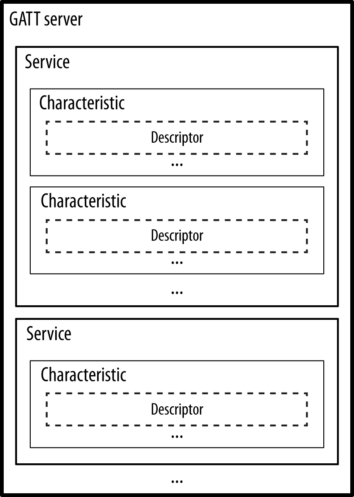

Services, characteristics, and descriptors are collectively referred to as attributes, and identified by UUIDs. A universally unique identifier (UUID) is a 128-bit (16 bytes) number that is guaranteed (or has a high probability) to be globally unique. For efficiency, and because 16 bytes would take a large chunk of the 27-byte data payload length of the Link Layer, the BLE specification adds two additional UUID formats: 16-bit and 32-bit UUIDs. These shortened formats can be used only with UUIDs that are defined in the Bluetooth specification (i.e., that are listed by the Bluetooth SIG as standard Bluetooth UUIDs).

To reconstruct the full 128-bit UUID from the shortened version, insert the 16- or 32-bit short value (indicated by xxxxxxxx, including leading zeros) into the Bluetooth Base UUID: `xxxxxxxx-0000-1000-8000-00805F9B34FB`.

___

A DSDTech SH-HC-08 module was used. The connection with Arduino remains the same as the HC-05 module using the default serial port on pins 0-1. 
On the iOS device the LightBlue application was used to read the module information such as Characteristic UUID.

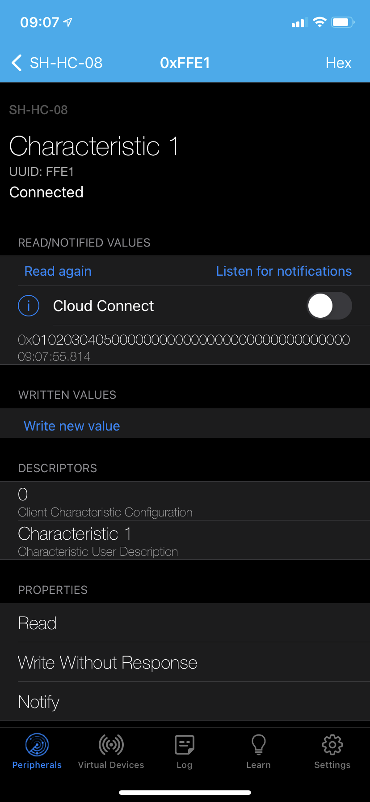

The DSD TECH Bluetooth application was also used to test the device for both reading and writing:

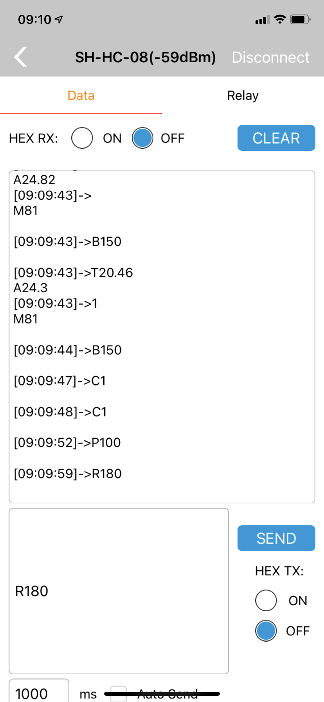

So we moved on [Thunkable](https://thunkable.com/#/) to develop the app. Thunkable allows us to develop an app in the same way as MIT App Invetor but also compatible with iOS. 

The graphical interface was designed in a similar way to what was done for android with App Inventor. The differences lie in the bluetooth communication. 

After several problems we have prepared a simplified interface with different labels and buttons to test the functionality. When the `Scan` button is clicked, the devices are scanned and shown in the first label. Then with the `Connect` button you connect to the default device (without the possibility of choosing others) and finally there is the possibility to send / receive data each time the `Send` button is pressed.

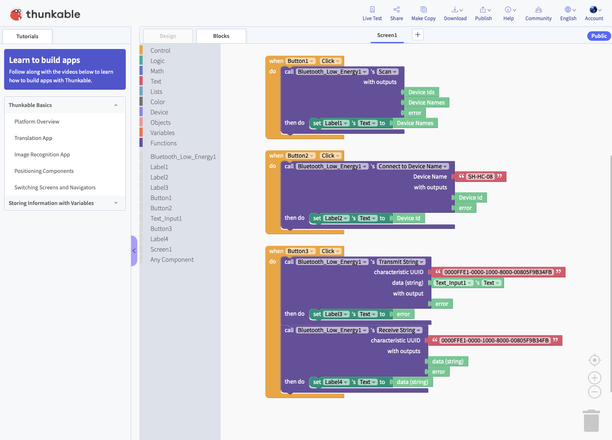

So we tested the app.

> At this point there is an issue with the app **which appears to be due to the thunkable's BLE interface**. Doing several tests on Android it turns out an `undefined` error during scanning. On iOS, on the other hand, the scanning and connection are perfectly successful but it is not possible to send / receive the data, which works with other apps with a serious interface. 

We are awaiting answers on Thunkable support. Searching the forum for references to problems in the BLE blocks.

## Data logging and storage

Given the recent interest in telemedicine it seemed appropriate to allow the storage of the experiment data directly in a remote server, giving the possibility to view them remotely and after. 

An environmental temperature and humidity sensor has also been integrated. 

Data are saved on a MySQL database reachable from a domain owned by one of us authors. 

For the visualization of the data we relied on the [Highcharts](https://www.highcharts.com/blog/products/highcharts/) libraries, a software library for dynamic charting written in pure JavaScript.

### Esp 8266

We have added a second device in order to make the system completely modular allowing you to add this step to save data remotely if you wish.
The NodeMCU is an open source platform developed specifically for the IOT, It includes a firmware that works through the ESP8266 SoC Wi-Fi module and hardware with the ESP-12E module base. To communicate with the computer it uses a CH340 chip.

The board is very powerful and we could have used it directly instead of arduino nano however we wanted to leave the modular system with the possibility of adding or not this functionality.


To read the data from Arduino Nano we have implemented a serial software on pin 3 and 4 transmitting the data with the same coding logic used in the previous steps.
From the side of the Arduino nano:

```c
void trasmitt (String param, String val) {
    invio = param + String(val);
    mySeriale.println(invio);
}
```

By passing it the different parameters such as `trasmitt("T", String(tempmpu))`.

On the ESP side we initially cleaned the string of extreme formatting characters (`decodeserial()`) and then passed it to a second function that takes care of transforming it into an char array (`process()`) and finally the actual decoding by updating the variables (`analizestring()`).

Moreover the device was powered by the 5V of the Arduino Nano in order to switch them on together. 

We also implemented software serial on the nodeMCU with a dedicate library.
```c
#include <SoftwareSerial.h>
SoftwareSerial Esp_serial(D3, D4);
```


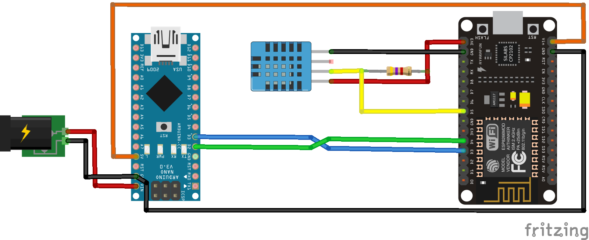

### DHT 11 

An ambient humidity and temperature sensor has been added. A DHT11 read using the Adafruit library for DHT sensors.

We have implemented this in a dedicated library:

```c
#include "DHT.h"
#define DHTTYPE DHT11   // DHT 11
const int DHTPin = D5;
DHT dht(DHTPin, DHTTYPE);
float h;
float t;
unsigned long timea=0;

void letturadht() {
   if (millis() - timea > 500) {
    h = dht.readHumidity();
    t = dht.readTemperature();
    Serial.println(h);
    Serial.println(t);
  timea=millis();
   }
}
```


### MySQL Database

On the server side we have created a dedicated database with a custom user. We will need this data (`db_name` and `username`) to implement the code after.

Using phpMyAdmin we have created a table ready to accept all the variables of interest:

```sql
CREATE TABLE Sensor (
    id INT(6) UNSIGNED AUTO_INCREMENT PRIMARY KEY,
    tempmpu VARCHAR(10),
    angle VARCHAR(10),
    average VARCHAR(10),
    bpm VARCHAR(10),
    soglia VARCHAR(10),
    temp VARCHAR(10),
    hum VARCHAR(10),
    reading_time TIMESTAMP DEFAULT CURRENT_TIMESTAMP ON UPDATE CURRENT_TIMESTAMP
)
```

### POST Request

To send data we use HTTP POST request. By design, the POST request method requests that a web server accepts the data enclosed in the body of the request message, most likely for storing it.

We must therefore connect the esp 8266 to the internet through the wifi library. You must also include a library for HTTP.

A function has been implemented that repeatedly sends a text message containing the variables concatenated in a string that the server will decode and position the data correctly.

```c
#include <ESP8266WiFi.h>
#include <ESP8266HTTPClient.h>
//timer
unsigned long t2 = 0;
unsigned long dt = 0;
unsigned long t3 = 200;//update database every

void servercall () {
  if (WiFi.status() == WL_CONNECTED) {
    HTTPClient http;
    http.begin(serverName);    
    http.addHeader("Content-Type", "application/x-www-form-urlencoded");
    dt = millis() - t2;
    if (dt >= t3) {
      String httpRequestData = "api_key=" + apiKeyValue + "&tempmpu=" + String(tempmpu)
                               + "&angle=" + String(angle) + "&average=" + String(average) 
                               +  "&bpm=" + String(BPM) + "&soglia=" + String(soglia)
                               + "&temp=" + String(t) + "&hum=" + String(h) + "";
      int httpResponseCode = http.POST(httpRequestData);
      t2 = millis();
    }
    http.end();
  }
}
```

Sensitive data such as wifi passwords and database usernames are saved in the `sensdata.h` file.

So the main code is as follows:

```c
#include "serialreceive.h"
#include "dhtread.h"
#include "wifidata.h"
void setup() {
  Serial.begin(9600); 
  Esp_serial.begin(9600); 
  dht.begin();
  WiFi.begin(ssid, password);
  Serial.println("Connecting to WiFi");
  while (WiFi.status() != WL_CONNECTED) {
    delay(1000);
    Serial.println(".");
  }
  Serial.println(WiFi.localIP());
}
void loop() {
  letturadht();
  servercall();
  decodeserial();
  delay(1);
}
```

A php page is called up on the server and takes care of decoding the data. 
The function takes care of receiving the complete string and identifying the various concatenated variables in the prescribed order, then absorbing them in the reference column by inserting it in the table. It also marks the time of insertion.

```php
<?php

$servername = "localhost";
$dbname = "dbname";
$username = "username";
$password = "user_pw";
$api_key_value = "APIKEY";
$api_key = $tempmpu = $angle = $average = $bpm = $soglia = $temp = $hum = "";
if ($_SERVER["REQUEST_METHOD"] == "POST") {
    $api_key = test_input($_POST["api_key"]);
    if($api_key == $api_key_value) {
        $tempmpu = test_input($_POST["tempmpu"]);
        $angle = test_input($_POST["angle"]);
        $average = test_input($_POST["average"]);
        $bpm = test_input($_POST["bpm"]);
        $soglia = test_input($_POST["soglia"]);
        $temp = test_input($_POST["temp"]);
        $hum = test_input($_POST["hum"]);
        $conn = new mysqli($servername, $username, $password, $dbname);
        if ($conn->connect_error) {
            die("Connection failed: " . $conn->connect_error);
        } 
        $sql = "INSERT INTO Sensor (tempmpu, angle, average, bpm, soglia, temp, hum)
        VALUES ('" . $tempmpu . "', '" . $angle . "', '" . $average . "',
                '" . $bpm . "','" . $soglia . "','" . $temp . "','" . $hum . "')";
        if ($conn->query($sql) === TRUE) {
            echo "New record created successfully";
        } 
        else {
            echo "Error: " . $sql . "<br>" . $conn->error;
        }
        $conn->close();
    }
    else {
        echo "Wrong API Key provided.";
    }
}
else {
    echo "No data posted with HTTP POST.";
}
function test_input($data) {
    $data = trim($data);
    $data = stripslashes($data);
    $data = htmlspecialchars($data);
    return $data;
}
```

### Data visualizing 

To read the data another php page is called. The code is divided into three sections. The first takes care of taking data from the database, a second takes care of the HTLM structures and a third of the graphs with the Highchart libraries.

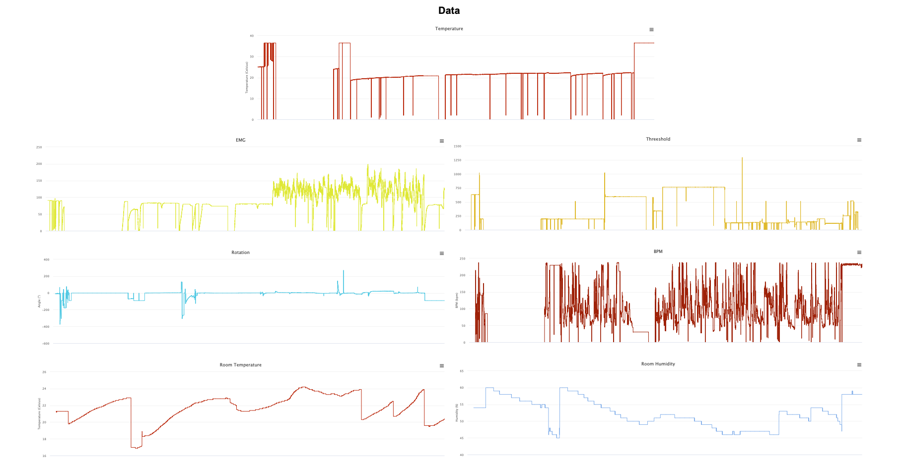

The web page with the data is accessible at the [following link](http://tempcontrol.it/progelettronica/chart.php?pwd=elettronica) or with this short link: [bit.ly/datiprogettoelettronica](http://bit.ly/datiprogettoelettronica). 

The web page is password protected with a php algorithm, insert `elettronica`.

A structure php page has been created in different sections. 

A first section deals with calling the database and reading the latest values. Yhis is also contained in the `call.php` file.
Then it saves the data in variables that will be recalled from the graphs. Obviously we are talking about arrays.

```php
$readings_time = array_column($sensor_data, 'reading_time');
$tempmpu = json_encode(array_reverse(array_column($sensor_data, 'tempmpu')), JSON_NUMERIC_CHECK);
$angle = json_encode(array_reverse(array_column($sensor_data, 'angle')), JSON_NUMERIC_CHECK);
$average = json_encode(array_reverse(array_column($sensor_data, 'average')), JSON_NUMERIC_CHECK);
$bpm = json_encode(array_reverse(array_column($sensor_data, 'bpm')), JSON_NUMERIC_CHECK);
$soglia = json_encode(array_reverse(array_column($sensor_data, 'soglia')), JSON_NUMERIC_CHECK);
$temp = json_encode(array_reverse(array_column($sensor_data, 'temp')), JSON_NUMERIC_CHECK);
$hum = json_encode(array_reverse(array_column($sensor_data, 'hum')), JSON_NUMERIC_CHECK);
$reading_time = json_encode(array_reverse($readings_time), JSON_NUMERIC_CHECK);
```

Then there is the html structure in which we have put different containers with their own style to organize the layout. 

```css
   body {
      min-width: 310px;
    	max-width: 90%;
    	height: 500px;
      margin: 0 auto;
    }
  .container { 
    position: center;
    column-count: 2;
    column-width: 50%;
    padding-top: 50px;
    }
```
And the page body:

```html
 <div class="container2">
    <div id="chart-tempmpu" class="container"></div>
    </div>

    <div class="containerinfo">
        <div id="chart-average" class="container"></div>
        <div id="chart-soglia" class="container"></div>
    </div>

    <div class="containerinfo">
        <div id="chart-angle" class="container"></div>
        <div id="chart-bpm" class="container"></div>
    </div>

    <div class="containerinfo">
        <div id="chart-temp" class="container"></div>
        <div id="chart-hum" class="container"></div>
    </div>
```

By recalling the variables containing the data, the graphs are built using the highcharts libraries and therefore with a javascript snippet such as:

```js
// ---
var tempmpu = <?php echo $tempmpu; ?>;
// ...
var reading_time = <?php echo $reading_time; ?>;
// ---
var chartT = new Highcharts.Chart({
  chart:{ renderTo : 'chart-tempmpu', zoomType: 'x', panning: true, panKey: 'shift' },
  title: { text: 'Temperature' },
  series: [{ showInLegend: false, data: tempmpu }],
  plotOptions: {line: { animation: false, dataLabels: { enabled: false } }, series: { color: '#C80303' }},
  xAxis: { type: 'datetime', labels: { enabled: false }, categories: reading_time },
  yAxis: {title: { text: 'Temperature (Celsius)' } },
  credits: { enabled: false }
});
// ...
```

To this is added an additional algorithm to protect the display of the graphs with a password:

```php
$password = 'elettronica';
// -------------------------
$pwd = isset($_GET['pwd']) ? $_GET['pwd'] : false;
if (!$pwd || $pwd != $password) {
  ?>
<form method="get" action="<?php echo $_SERVER['PHPSELF']; ?>">
<table border="0" cellspacing="0" cellpadding="10">
<?php if ($pwd !== false): ?><tr class="errore"><td colspan="3">La password inserita non è corretta!</td></tr><?php endif; ?>
<tr>
  <td>Password</td>
  <td><input type="password" name="pwd" style="width: 180px;"/></td>
  <td><input type="submit" value="Entra"/></td>
</tr>
</table>
</form>  
  <?php  
}else{ 
  ?>
    // ALL THE CONTENTS
  <?php  
}
?>
```

The graphs are widely customizable in particular the possibility of zooming in a certain time interval and scrolling along the time axis has been activated. It is also possible to select a single value and read other information such as the save time

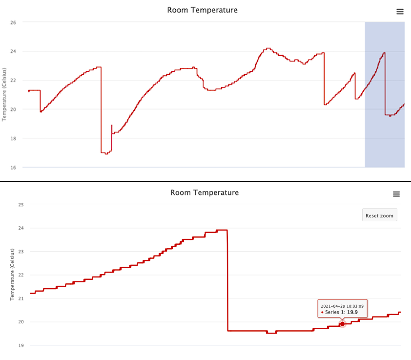

## Make it more compact

To make everything more compact and avoid the problems due to the lack of stability of the breadboards we decided to solder everything on a multi-hole circuit. However, to allow testing and component replacement we used multi-pin connectors. 

### Sensors cable

To allow easy transport and disassembly we have combined all sensors in a single cable.

The cable of the EMG with its 3.5 mm jack is excluded.
We used a Cat 5e cable with T568B Wiring scheme.

We connected together VCC and GND of the two sensors and the pulse sensor data arrives on pin A3.

The sensors were connected as follows:

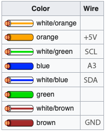


### Reading station

In order to have a compact but at the same modular structure and that would allow to carry out different tests, we stacked several multi-hole prototype boards. 
There are also a 3.5mm female jack connector for the electromyography cable and an RJ45 connector for the sensor cable.
On the top floor there is the LCD display and the trimmer to adjust the threshold, easily accessible


### Power supply

To allow use without discharging the batteries or powering from a computer with usb we have recycled power supplies for electronic devices. 

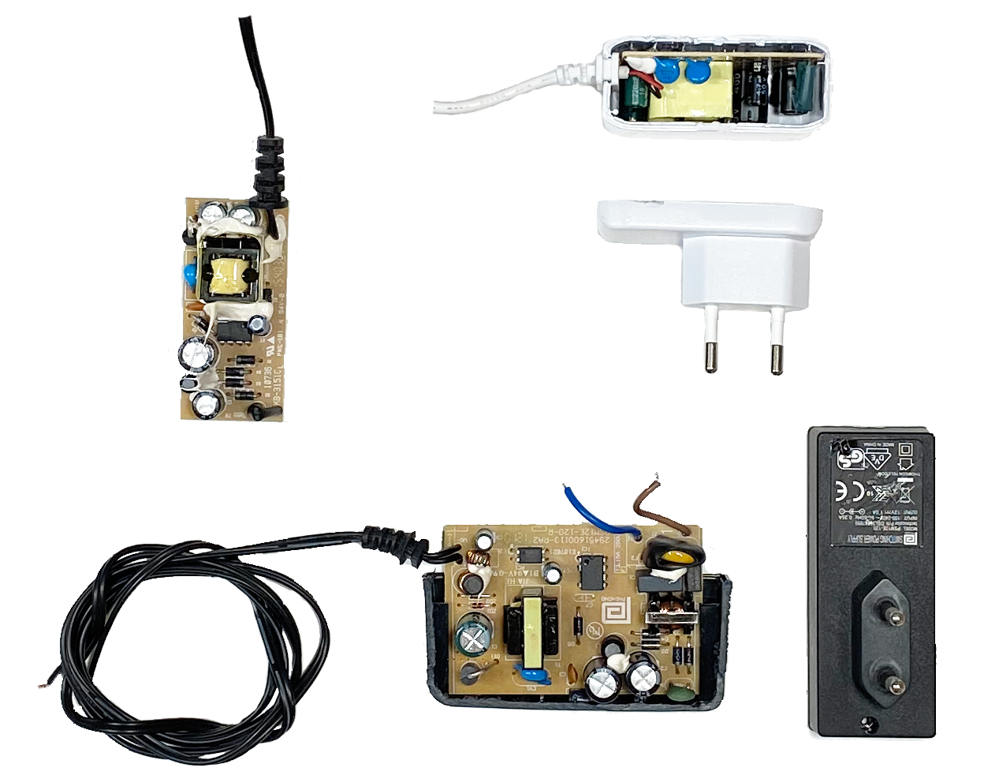

We used two different 9V power supplies by joining a clamp (+) with a (-) obtaining a ground reference in order to have +9V and -9V on the other two cables. This is to power the electromyography circuit

We added a 12V power supply to power the arduino nano from `Vin` which in turn powers the Esp8266 and the whole system.

We then connected everything in the base of the reading station so as to power everything with a single cable with C13 connector. 

Two switches have also been added in order to selectively access the system and the power supply for the EMG

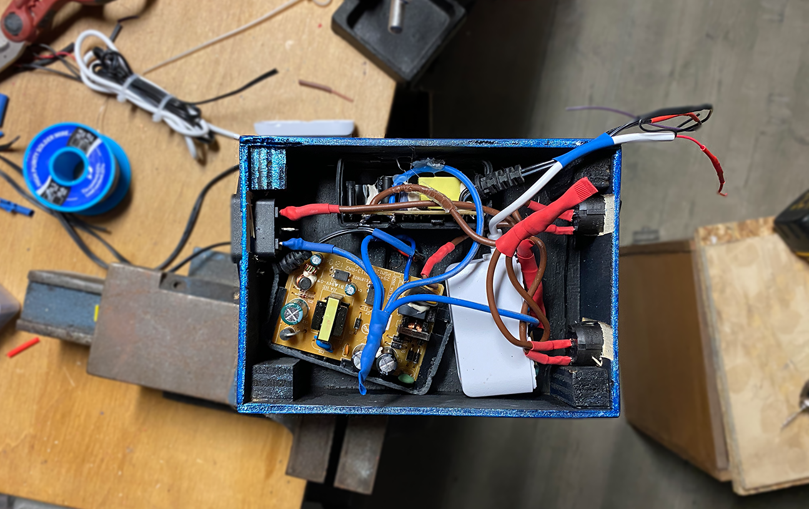

In conclusion, the entire data reading system looks like this:

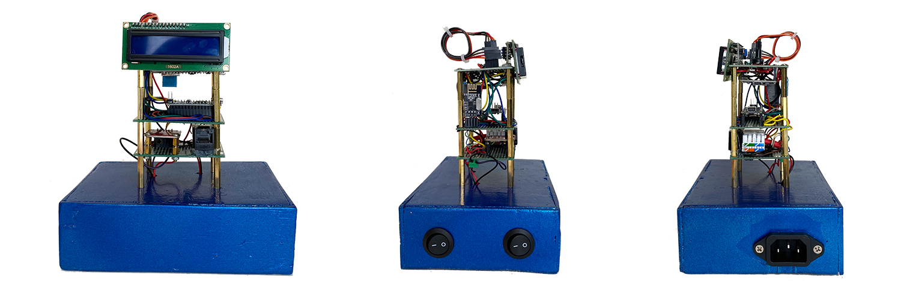

## Conclusions and future developments

The temperature sensor does not report perfectly the temperature of the subject and could be replaced with a sensor in contact with the skin and possibly an algorithm designed to bring the peripheral temperature back to the central one.

The use of a more advanced EMG sensor such as MyoWare allows you to reduce noise and have a more compact structure.

To develop an application for iOS it is necessary to replace the bluetooth module with one with Bluetooth Low Energy such as the SH-HC-08 module. 

To increase data security with a view to respecting privacy and the GDPR regulations for the processing of personal data online, it is certainly necessary to provide a security algorithm that is much more serious than simply hiding the content of the page with the php script. In addition, it may be advisable to encrypt the data even before sending it to the server and to activate the HTTPS protocol on the web page.

For the environmental temperature and humidity it may be appropriate to replace the DHT11 with a DHT22, thus obtaining a sensitivity of 0.5 ° C and 2% RH.

For the power supply, instead of three power supplies, a single 18V power supply could be used with a voltage divider to obtain ± 9V.

Finally, the reading station could be redesigned on PCB in order to have a single more compact plane.


## References

- [nRF24L01 Wireless RF Module](https://components101.com/wireless/nrf24l01-pinout-features-datasheet)
- [Arduino Wireless Communication](https://www.youtube.com/watch?v=7rcVeFFHcFM)
- [EMG Circuit for a Microcontroller](http://www.instructables.com/member/Gundanium/?utm_source=pdf&utm_campaign=title)
- [Electromyography(EMG) with MyoWare Muscle Sensor & Arduino](https://how2electronics.com/electromyography-emg-with-myoware-muscle-sensor-arduino/)
- [Muscel Sensor V3 Datasheet](http://www.advancertechnologies.com/p/muscle-sensor-v3.html)
- [pulsesensor.com](https://pulsesensor.com)
- [FIAB elettrodi](https://www.fiab.it/prodotti.php)
- [LCD custom generator](https://maxpromer.github.io/LCD-Character-Creator/)
- [Fritzing standard](https://fritzing.org/learning/tutorials/creating-custom-parts)
- [Make your own fritzing parts](https://learn.sparkfun.com/tutorials/make-your-own-fritzing-parts/all)
- [Arduino smoothing](https://www.arduino.cc/en/Tutorial/BuiltInExamples/Smoothing)
- [Uno pinout guide](https://www.circuito.io/blog/arduino-uno-pinout/)
- [Nano pinout guide](https://www.makerguides.com/arduino-nano/)
- [ESP8266 pinout](https://randomnerdtutorials.com/esp8266-pinout-reference-gpios/)
- [Elettromiografia](https://it.wikipedia.org/wiki/Elettromiografia_ed_elettroneurografia#:~:text=L'elettromiografia%20(EMG)%2C,dal%20punto%20di%20vista%20funzionale.)
- [ECG](https://it.wikipedia.org/wiki/Elettrocardiogramma)
- [Anatomy of The DIY Heart Rate Monitor](https://pulsesensor.com/blogs/news/6326816-anatomy-of-the-diy-heart-rate-monitor) 
- [HC 06 per Arduino ](https://www.giuseppecaccavale.it/arduino/hc-06-bluetooth-arduino/)
- [Elettrodi Top Trace](https://www.elettromedicali.it/diagnostica/elettrocardiografi/elettrodi-monouso-per-ecg/prodotto-elettrodi-pregellati-in-foam-per-ecg-e-stress-test-36x42-mm-solid-gel-confez-da-50pz/) 
- [HTTP POST](https://en.wikipedia.org/wiki/POST_(HTTP))
- [tempcontrol.it](https://github.com/mastroalex/tempcontrol)
- [Il manuale di Arduino](https://www.zeppelinmaker.it/il-manuale-di-arduino/?v=532773df6f8a)
- [Programmare](https://www.zeppelinmaker.it/programmare-2/?v=532773df6f8a)
- [PHP Pwd](https://www.mrw.it/php/pagina-protetta-password_11675.html)

## Authors 

- [Mastrofini Alessandro](https://www.linkedin.com/in/alessandro-mastrofini/)
- Rago Miriana
- Volpato Rebecca
